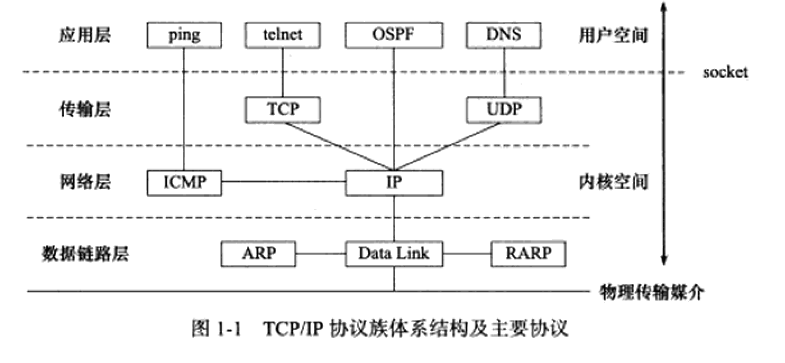
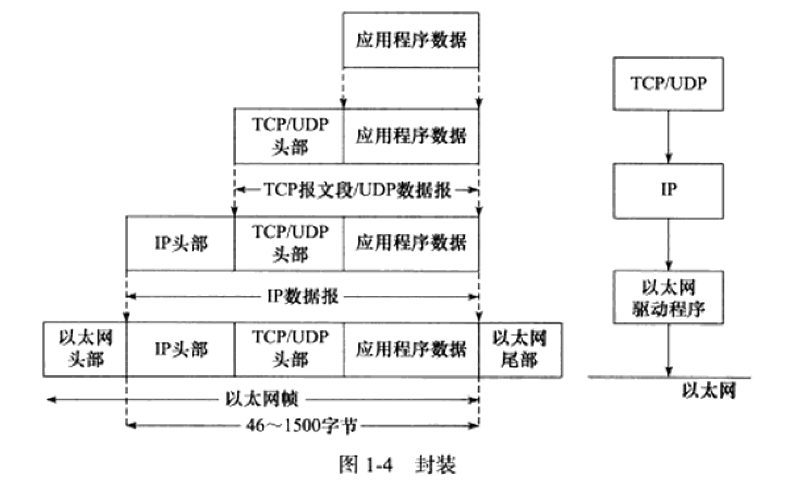

# Linux高性能服务器编程

## 第1章 TCP/IP协议族

* TCP/IP协议族是一个分层、多协议的通讯体系
* 介绍相关协议：ICMP协议、ARP协议、DNS协议
* 文档：RFC(Request For Comments,评论请求)

### 1.1 TCP/IP协议族体系结构以及主要协议

TCP/IP协议族是一个四层协议系统，自底而上分别是数据链路层、网络层、传输层和应用层。



#### 1.1.1 数据链路层

<font color=red>数据链路层</font>实现了网卡接口的网络驱动程序，以处理数据在物理媒介（比如以太网、令牌环等）上的传输。

两个常用的协议是:

* ARP（Address Resolve Protocol,地址解析协议）

* RARP协议（Reverse Address Resolve Protocol, 逆地址解析协议）。

它们实现了IP地址和机器物理地址之间的互相转换。

#### 1.1.2 网络层

网络层实现数据包的选路和转发。

#### 1.1.3 传输层

传输层为两台主机上的应用程序提供端到度(end to end)的通讯。与网络层使用的逐跳通讯方式不同，传输层值关心通信的起始端和目的端，而不在乎数据包的中转过程。

传输层协议主要有三个：TCP协议、UDP协议和SCTP协议

* TCP协议(Transmission Control Protocol,传输控制协议)为应用层提供可靠的、面向连接的和基于流(stream)的服务。
* UDP协议(User Datagram Protocol, 用户数据报协议)则与TCP协议完全相反，它为应用层提供不可靠、无连接和基于数据报的服务。
* SCTP协议(Stream Control Transmission Protocol, 流控制传输协议)是一种相对较新的传输层协议，它是为了在因特网上传输电话信号而设计的。

#### 1.14 应用层

应用层负责处理应用程序的逻辑。数据链路层、网络层和传输层负责处理网络通讯细节，这部分必须即稳定又高兴，因此它们都在内核空间中实现，而应用层则在用户空间实现。


### 1.2 封装

应用程序在发送到物理网络之前，将沿着协议栈从上往下依次传递。每层协议都将在上层数据的基础上加上自己的头部信息(有时还包括尾部信息)，以实现该层的功能，这个过程称为<font color=red>封装</font>：



经过TCP封装后的数据称为<font color=red>TCP报文段（TCP message segment）</font>，或者简称TCP段

经过UDP封装后的数据称为<font color=red>UDP数据报（UDP datagram）</font>

经过IP封装后的数据称为<font color=red>帧（frame）</font>:

* 以太网上传输的是以太网帧（ethernet frame）
* 令牌环路上传输的则是令牌环帧（token ring frame）

帧的<font color=red>最大传传输单元（Max Transmit Unit, MTU）</font>,即帧最多能携带多少上层协议数据（比如IP数据报），通常受到网络类型的限制。


## 第13章 多进程编程

### 13.1 fork系统调用

```c
#include <sys/types.h>
#include <unistd.h>
pid_t fork(void);
```

* 每次调用返回两次，在父进程中返回的是子进程的pid，在子进程中则返回0
* 调用失败时返回-1，并设置errno


## 疑问：

1.5 

* 问题1：ARP协议是属于网络层还是链路层

* 问题2：APR协议和IP协议的关系：IP协议每次发送数据都要经过APR协议确认IP对应的MAC地址吗：
  * 答：我们以主机A（192.168.1.5）向主机B（192.168.1.1）发送数据为例。当发送数据时，主机A会在自己的ARP缓存表中寻找是否有目标IP地址。如果找到了，也就知道了目标MAC地址，直接把目标MAC地址写入帧里面发送就可以了；如果在ARP缓存表中没有找到相对应的IP地址，主机A就会在网络上发送一个广播，目标MAC地址是“FF.FF.FF.FF.FF.FF”，这表示向同一网段内的所有主机发出这样的询问：“192.168.1.1的MAC地址是什么？”网络上其他主机并不响应ARP询问，只有主机B接收到这个帧时，才向主机A做出这样的回应：“192.168.1.1的MAC地址是00-aa-00-62-c6-09”。这样，主机A就知道了主机B的MAC地址，它就可以向主机B发送信息了。同时它还更新了自己的ARP缓存表，下次再向主机B发送信息时，直接从ARP缓存表里查找就可以了。ARP缓存表采用了老化机制，在一段时间内如果表中的某一行没有使用，就会被删除，这样可以大大减少ARP缓存表的长度，加快查询速度。