# Linux高性能服务器编程

## 第1章 TCP/IP协议族

* TCP/IP协议族是一个分层、多协议的通讯体系
* 介绍相关协议：ICMP协议、ARP协议、DNS协议
* 文档：RFC(Request For Comments,评论请求)

### 1.1 TCP/IP协议族体系结构以及主要协议

TCP/IP协议族是一个四层协议系统，自底而上分别是数据链路层、网络层、传输层和应用层。


#### 1.1.1 数据链路层

<font color=red>数据链路层：</font>实现了网卡接口的网络驱动程序，以处理数据在物理媒介（比如以太网、令牌环等）上的传输。

两个常用的协议是:

* ARP（Address Resolve Protocol,地址解析协议） 
  * --> 网络层使用数据链路层的服务需要将ip转成物理地址
* RARP协议（Reverse Address Resolve Protocol, 逆地址解析协议）
  *  --> 无盘工作站无法记住自己的ip地址 向 运行rarp服务的管理者查询自身ip地址

它们实现了IP地址和机器物理地址之间的互相转换。

网络层使用IP地址寻找一台机器，而数据链路层使用物理地址寻找一台机器。

#### 1.1.2 网络层

**网络层实现数据包的选路和转发：**

1. WAN使用众多分级的路由器连接分散的主机或LAN，通信的两台主机一般是通过多个中间节点（路由器）连接的。

2. 所以网络层的任务：
   * 选择通信中间节点，确定两台主机之间的通信路径
   * 对上层协议隐藏网络拓扑的连接细节

**网络层的协议:**

* 网络层最核心的协议是IP协议（Internet Protocal, 因特网协议）。IP协议根据数据包的目的IP地址来决定如何投递它。
* ICMP协议（Internet Control Message Protocal,因特网控制报文协议）：它是ip协议的重要补充，主要用于检测网络连接。

**ICMP协议：**

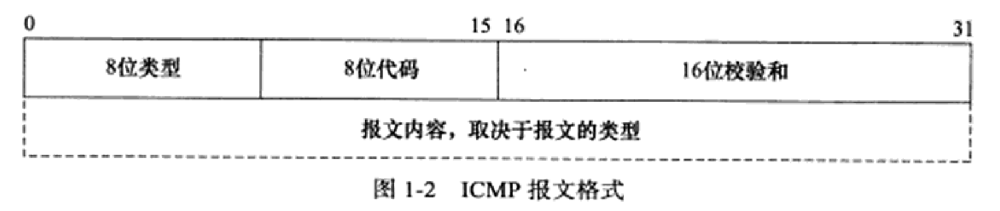

<font color=red>各字段的含义：</font>

* 8位类型字段

  用于区分报文类型。它将ICMP报文分为两大类：

  * 差错报文

    这类报文主要用来回应网络错误，比如目标不可达（类型值位3）和重定向（值为5）.

  * 查询报文

    这类报文用来查询网络信息，比如ping程序就是使用ICMP报文查看目标是否可到达（类型值为8）的。

* 8位代码字段

  有的ICMP报文还使用8位代码字段来进一步细分不同的条件。比如重定向报文使用代码值0表示对网络重定向，代码值1表示对主机重定向。

* 16位校验和字段

  对整个报文（包括头部和内容部分）进行循环冗余校验（Cyclic Redundancy Check, CRC）,以校验报文在传输过程中是否损坏。

需要指出的是，ICMP协议并非严格意义上的网络层协议，因为它使用处于同一层的IP协议提供的服务（一般来说，上层协议是使用下层协议提供的服务）

#### 1.1.3 传输层

传输层为两台主机上的应用程序提供端到端(end to end)的通讯。传输层只关心通信的起始端和目的端，而不在乎数据包的中转过程。

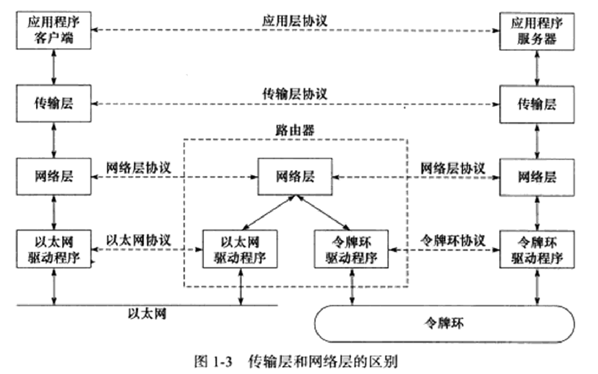


传输层协议主要有三个：

* TCP协议(Transmission Control Protocol,传输控制协议) 
  * 为应用层提供可靠的、面向连接的和基于流(stream)的服务。
* UDP协议(User Datagram Protocol, 用户数据报协议)
  * 则与TCP协议完全相反，它为应用层提供不可靠、无连接和基于数据报的服务。
* SCTP协议(Stream Control Transmission Protocol, 流控制传输协议)
  * 一种相对较新的传输层协议，它是为了在因特网上传输电话信号而设计的。

#### 1.14 应用层

应用层负责处理应用程序的逻辑

* 数据链路层、网络层和传输层负责处理网络通讯细节，这部分必须即稳定又高效，因此它们都在<font color=red>内核空间</font>中实现
* 应用层则在<font color=red>用户空间</font>实现，因为它负责处理众多逻辑，比如文件传输、名称查询和网络管理。

通过/etc/services文件 --> 可查看所有知名的应用层协议，以及它们都能使用哪些传输层服务。

### 1.2 封装

<font color=red>封装</font>：每层协议在上层数据加上自己的头部信息(有时还包括尾部信息)，以实现该层的功能 


* <font color=red>TCP报文段（TCP message segment， 简称：tcp段）</font>：经过TCP封装后的数据

  TCP协议为通信双方维持一个连接，并且在内核中存储相关数据。这部分数据中的TCP头部信息和TCP内核缓冲区（发送缓冲区或接收缓冲区）数据一起构成了TCP数据段，如图1-5中的虚线框所示：

  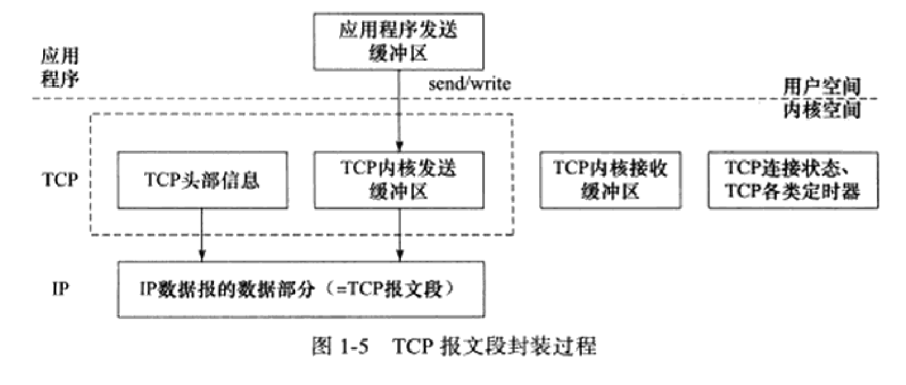

* <font color=red>UDP数据报（UDP datagram）</font>：经过UDP封装后的数据

  UDP --> 无须为应用层数据保存副本 --> 提供不可靠的服务(UDP数据包被成功发送之后，UDP内核缓冲区中的数据包就被丢弃了)

* <font color=red>IP数据报（IP datagram）</font>：经过IP封装后的数据

* <font color=red>帧（frame）</font>：经过数据链路层封装的数据

  * 传输媒介不同，帧的类型也不同：
    * 以太网上传输的是以太网帧（ethernet frame）
    * 令牌环路上传输的则是令牌环帧（token ring frame）

  * 帧的<font color=red>最大传传输单元（Max Transmit Unit, MTU）</font>,即帧最多能携带多少上层协议数据（比如IP数据报），通常受到网络类型的限制。

  * 图1-6所示的以太网帧的MTU是1500字节，所以过长的IP数据报可能需要被分片（fragment）传输。帧才是最终在物理网络上传送的字节序列。

    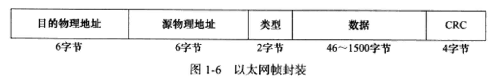

### 1.3 分用

​        当帧到达目的主机时，将沿着协议栈自底向上依次传递。各层协议异次处理帧中本层负责的头部数据，以获取所需的信息，并最终将处理后的帧交给目标程序。这个过程称为<font color=red>分用（demultiplexing）</font>。分用是依靠头部信息中的类型字段实现的。

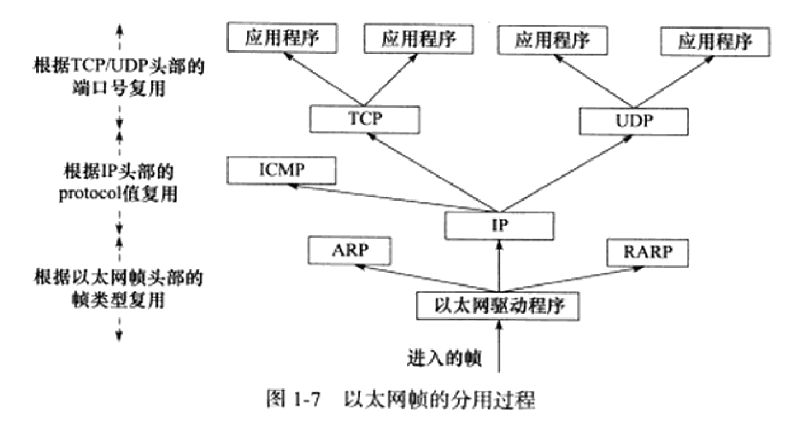


### 1.4 测试网络

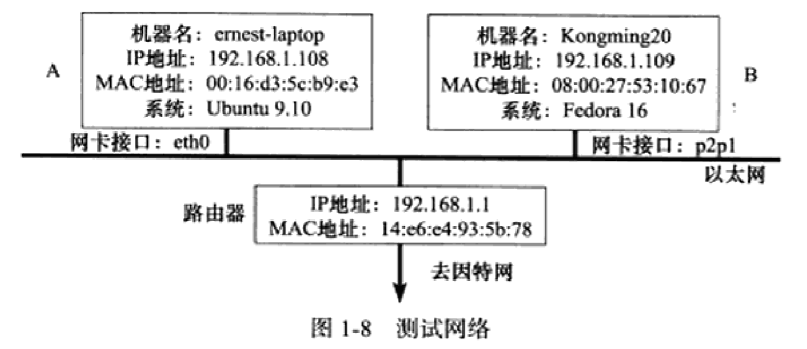

### 1.5 ARP协议工作原理

ARP协议：

​	任意网络层地址 --转换-->任意物理地址。

​	<font color=red>其工作原理是</font>：主机向自己所在网络广播一个ARP请求，该请求包含目标机器的网络地址。此网络上的其他机器都将收到这个请求，但只有被请求的目标机器会回应一个ARP应答，其中包含自己的物理地址。

#### 1.5.1 以太网ARP请求/应答报文详解

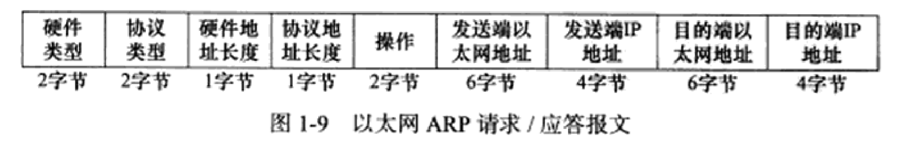

各字段具体介绍：

* 硬件类型字段：定义物理地址的类型，它的值为1表示MAC地址

* 协议类型字段：表示要映射的协议地址类型，如：类型为IP地址，则它的值为0x800

* 硬件地址长度字段和协议地址长度字段：单位是字节。对MAC地址来说，其长度为6；对IP（v4）地址来说，其长度为4

* 操作字段指出4种操作类型：

  * ARP请求（值为1）
  * ARP应答（值为2）
  * RARP请求（值为3）
  * RARP应答（值为4）

* 最后4个字段：指定通信双方的以太网地址和IP地址。

  发送端填充除目的端以太网地址外的其他3个字段，以构建ARP请求并发送之。接收端发现该请求的目的端IP地址是自己的，就把自己的以太网地址填进去，然后交换两个目的端地址和两个发送端地址，以构建ARP应答并返回之（当然，如前所述，操作字段需要设置为2）。

#### 1.5.2 ARP高速缓存的查看和修改

<font color=red>ARP维护一个高速缓存</font>:

* 其中包含经常访问（比如网关地址）或最近访问的机器的IP地址到物理地址的映射。这样就避免了重复的ARP请求，提高了发送数据包的速度。

linux下可以使用arp命令来查看和修改ARP高速缓存：

* arp -a命令：查看ARP缓存内容
* arp -d 192.168.1.109 : 删除对应的ARP缓存项
* arp -s 192.168.1.109 08:00:27:53:10:67  添加对应的ARP缓存项


#### 1.5.3 使用tcpdump观察ARP通信过程

从ernest-laptop上执行telnet命令登陆Kongming20的echo服务(以及开启)，并用tcpdump抓取(在ernest-laptop机器上执行)这个过程中两台测试机器之间交换的以太网帧。具体过程:

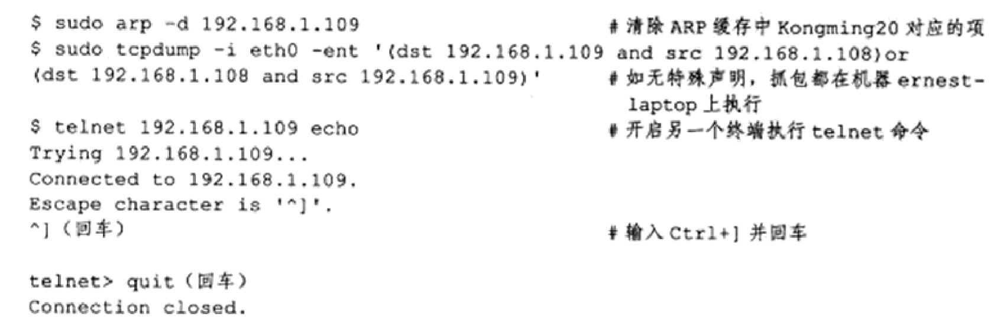

说明：

* 在telnet之前，先清除ARP缓存中与Kongming20对应的项，否则ARP通信不被执行，我们也就无法抓取到期望的以太网帧

* tcpdump抓取到的众多数据包中，只有最靠前的两个和ARP通信有关系，现在将它们列出（数据包编号是作者加入的）

  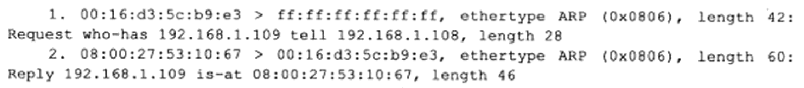

  * 第一个数据包：

    * ARP通信的源端的物理的地址是00:16:d3:5c:b9:e3(ernest-laptop),目的端的物理地址是ff:ff:ff:ff:ff:ff，这是以太网的广播地址，用以表示整个LAN。该LAN上的所有机器都会收到并处理这样的帧。
    * 数值0x806是以太网帧头部的类型字段的值，它表示分用的目标是ARP模块。
    * 该以太网帧的长度为42字节（实际上是46字节，tcpdump未统计以太网帧尾部4字节的CRC字段），其中数据部分长度为28字节。
    * “Request”表示这是一个ARP请求，“who-has 192.168.109 tell 192.168.1.108”则表示是ernest-laptop要查询Kongming20的IP地址

  * 第二个数据包：

    * ARP通信的源端的物理地址是08:00:27:53:10:67(Kongming20)，目的端的物理地址是00:16:d3:5c:b9:e3(ernest-laptop)。
    * “Reply”表示这是一个ARP应答，“192.168.1.109 is-at 08:00:27:53:10:67”则表示目标机器Kongming20报告其物理地址。该以太网的长度为60字节（实际上是64字节），可见它使用了填充字节来满足最小帧长度。

  * 为了便于理解，我们将上述讨论用图1-10来详细说明：

    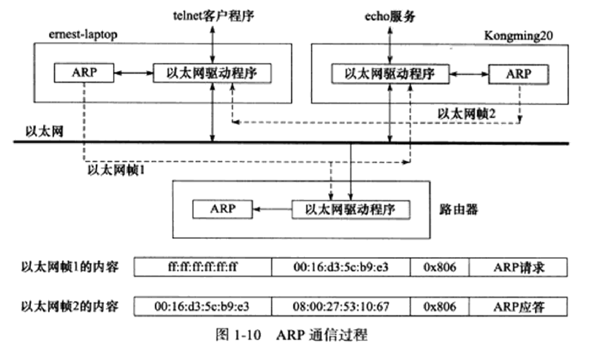


### 1.6 DNS工作原理

**域名查询服务：**将机器的域名转换成IP地址。

域名查询服务有很多种实现方式，如：

* NIS(Network Information Service, 网络信息服务)
* DNS
* 本地静态文件等。

#### 1.6.1 DNS查询和应答报文详解

DNS是一套分布式的域名服务系统。每个DNS服务器上都存放着大量的机器名和IP地址的映射，并且是动态更新的。众多网络客户端程序都使用DNS协议来向DNS服务器查询目标主机的IP的地址。DNS查询和应答报文的格式如图1-11所示：

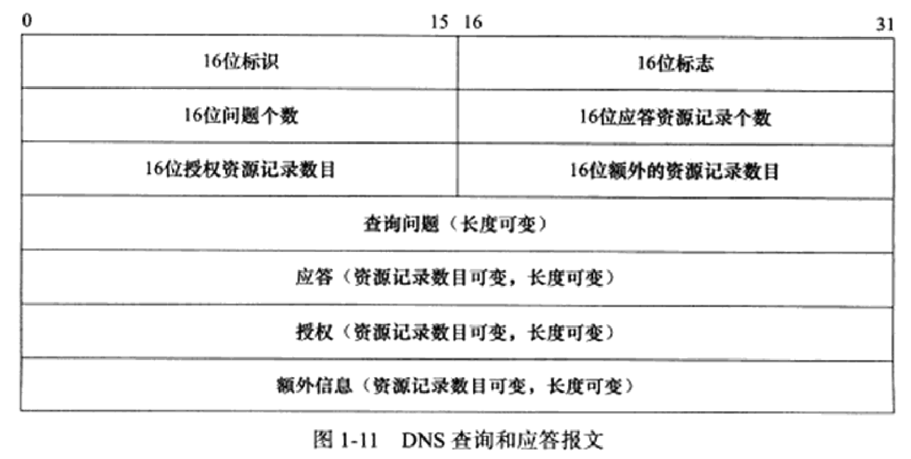

* 16位标识字段用于标记一对DNS查询和应答，以此来区分一个DNS应答是哪个DNS查询的回应

* 16位标志字端用于协商具体的通信方式和反馈通信状态。DNS报文头部的16位标志字段的细节如图1-12所示：

  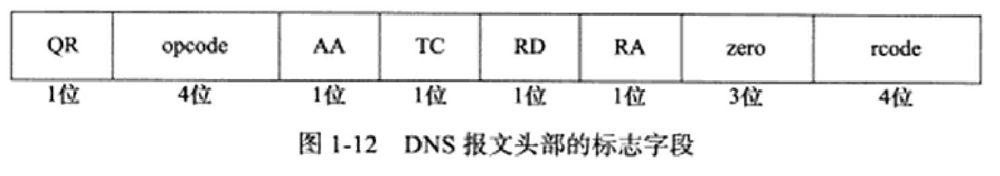

  * QR，查询/应答标志

    0表示这是一个查询报文，1表示这是一个应答报文

  * opcode,定义查询和应答的类型

    0表示标准查询，1表示反向查询（由IP地址获得主机域名），2表示请求服务器状态。

  * AA，授权应答标志

    仅由应答报文使用。1表示域名服务器是授权服务器

  * TC，截断标志

    仅当DNS报文使用UDP服务时使用.因为UDP数据报由长度限制，所以过长的DNS报文将被截断。1表示DNS报文超过512字节，并被截断。

  * RD，递归查询标志。

    1表示执行递归查询，即如果目标DNS服务器无法解析某个主机名，则它将向其他DNS服务器继续查询，如此递归，直到获得结果并把该结果返回给客户端。0表示执行迭代查询，即如果目标DNS服务器无法解析某个主机名，则它将字节知道的其他DNS服务器的IP地址返回给客户端，以共客户端参考。

  * RA,允许递归标志

    仅由应答报文使用，1表示DNS服务器支持递归查询

  * zero,这3位未用，必修都设置为0.

  * rcode,4位返回码

    表示应答的状态。常用值有0（无错误）和3（域名不存在）

* 接下来的4个字段则：

  分别表示DNS报文的最后4个字段的资源记录数目。对查询报文而言。它一般包含1个查询问题。而应答资源记录数、授权资源记录数和额外资源记录数则为0。应答报文的应答资源记录数则至少为1，而授权资源记录数和额外资源记录数可为0或非0.

* 查询问题，格式如图1-13所示：

  查询名以一定的格式封装了要查询的主机域名。

  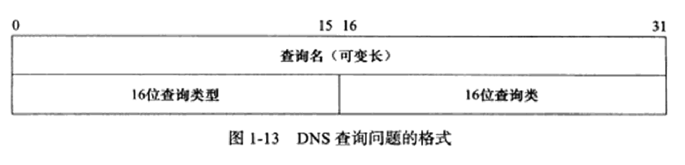

  * 16位查询类型表示如何执行查询操作，常见的类型有如下几种：
    * 类型A，值是1，表示获取目标主机的IP地址
    * 类型CNAME，值是5，表示获得目标主机的别名
    * 类型PRT，值是12，表示反向查询
  * 16位查询类通常为1，表示获取因特网地址（IP地址）

* 应答字段、授权字段和额外信息字段都使用资源记录（Resource Record, RR）格式。资源记录格式如图1-14所示：

  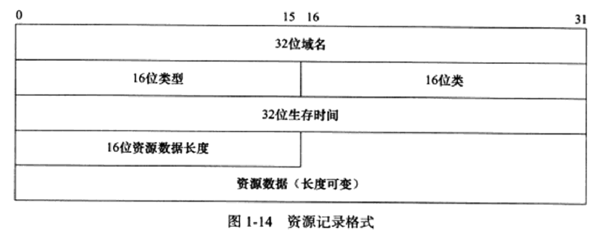

  * 32位域名

    是该记录中与资源对应的名字，其格式和查询问题中的查询名字段相同。

  * 16位类型和16位类字段

    含义也与DNS查询问题的对应字段相同。

  * 32位生存时间

    表示查询记录结果可被本地客户端程序缓存多长时间，单位是秒

  * 16位资源数据长度字段和资源数据字段

    内容取决于类型字段。对类型A而言，资源数据是32位的IPv4地址，而资源数据长度则位4（以字节位单位）

#### 1.6.2 Linux下访问DNS服务

<font color=red>要访问DNS服务，就必须先知道DNS服务器的IP地址。</font>

Linux使用/etc/resolv.conf文件来存放DNS服务器的IP地址。大致内容如下：

```
# Generated by Network Manager
nameserver 219.239.26.42
nameserver 124.207.160.106
```

说明：

* 两个IP地址分别是首选DNS服务器地址和备用DNS服务器地址
* “Generated by Network Manager”表示，这两个DNS服务器地址是由网络管理程序写入的


**host命令：**

* linux常用来访问DNS服务器的客户端程序host

* 使用host命令来向DNS服务器查询机器www.baidu.com的IP地址：

```shell
$ host -t A www.baidu.com
www.baidu.com is an alias for www.a.shifen.com
www.a.shifen.com has address 119.75.217.56
www.a.shifen.com has address 119.75.218.77
```

说明：

* 机器名www.baidu.com是www.a.shifen.com的别名，并且该机器名对应两个IP地址
* host命令使用DNS协议和DNS服务器通信，其-t选项高速DNS协议使用哪种查询类型。我们这类使用的是A类型，即通过机器的域名获得其IP地址（但实际上返回的资源记录中还包含机器的别名）。

#### 1.6.3 使用tcpdump观察DNS通信过程

为了看清楚DNS通信的过程，我们将从ernest-laptop上允许host命令以查询主机www.baidu.com对应的IP地址，并使用tcpdump抓取这一过程中LAN上传输的以太网帧，具体的操作过程如下：

```
$ sudo tcpdump -i eth0 -nt -s 500 port domain
$ host -t A www.baidu.com
```

使用"port domain"来过滤数据包，表示只抓取使用domain(域名)服务的数据包，即DNS查询和应答报文。

数据包如下：

```
1. IP 192.168.1.108.34319 > 192.168.2.254.53: 57428+ A? www.baidu.com. (31)
2. IP 219.239.26.42.53 > 192.168.1.108.34319: 57428 3/4/4 CNAME www.a.shifen.com., A 182.61.200.7, A 182.61.200.6 (226)
```

说明：

* 这两个数据包开始的“IP”指出，它们后面的内容描述的是IP数据报。tcpdump以"IP地址.端口号"的形式来描述通信的某一端
* 第一个数据包
  * 数值57428是DNS查询报文的标识值，因此该值也出现在DNS应答报文中
  * "+"表示启用递归查询标志
  * “A?”表示使用A类型的查询方式
  * “www.baidu.com”则是DNS查询问题中的查询名
  * 括号中的数值31是DNS查询报文中的长度（以字节位单位）
* 第二个数据包
  * “3/4/4”表示该报文中包含3个应答资源记录、4个授权资源记录和4个额外信息记录。
  * “CNAME www.a.shifen.com, A 119.75.218.77, A 119.75.217.56”则表示3个应答资源记录的内容。其中CNAME表示紧随其后的记录是机器的别名，A表示紧随其后的记录是IP地址。该应答报文的长度位226字节。

### 1.7 socket和TCP/IP协议族的关系

​	数据链路层、网络层、传输层协议是在内核中实现的。因此操作系统需要实现一组系统调用使得应用程序能够访问这些协议提供的服务。

实现这组系统调用的API主要有两套：

* socket

  图1-1显示了socket与TCP/IP协议族的关系。

* XTI

  XTI现在基本不再使用

由socket定义的这一组API提供如下两点功能：
* 将应用程序数据从用户缓冲区中复制到TCP/UDP内核发送缓冲区，以交付内核来发送数据（比如图1-5所示的send函数），或者是从内核TCP/UDP接受缓冲区中复制数据到用户缓冲区，以读取数据

* 应用程序可以通过它们来修改内核中各层协议的某些头部信息或其他数据结构，从而精细地控制底层通信的行为。比如可以通过setsocketopt函数来设置IP数据报在网络上的存活时间

​        值得一提的是，socket是一套通用网络编程接口，它不但可以访问内核中TCP/IP协议栈，而且可以访问其他网络协议栈（比如X.25协议栈、UNIX本地域协议栈等）。


## 第2章 IP协议详解

本章从两个方面较为深入地讨论IP协议：

* **IP头部信息。**IP头部信息出现在每个IP数据报中，用于指定IP通信的源端IP地址、目的端IP地址，指导IP分配和重组，以及指定部分通信行为
* **IP数据报的路由和转发。**IP数据报的路由和转发发生在出目标机器之外的所有主机和路由器上。它们决定数据报是否一概转发以及如何转发。

### 2.1 IP服务的特点

IP协议是TCP/IP协议族的动力，它位上层协议提供无状态、无连接、不可靠的服务。

* <font color=red>无状态（stateless）</font>

  指IP通信双方不同步传输数据的状态信息，因此所有IP数据报的发送、传输和接受都是相互独立、没有上下文关系的。这种服务最大的缺点是无法处理乱序和重复的IP数据报。无状态服务的有点也很明显：简单、高效。

* <font color=red>无连接（connnectionless）</font>

  指IP通信双方都不长久地维持对方的任何信息。这样，上层协议每次发送数据的时候，都必须明确指定对方的IP地址。

* <font color=red>不可靠</font>

  指IP协议不能保证IP数据报准确地到达接收端，它只承诺尽最大的努力（best effort）。

### 2.2 IPv4头部结构

IPv4的头部结构如图2-1所示，其<font color=red>长度通常为20字节，除非含有可变长的选项部分</font>

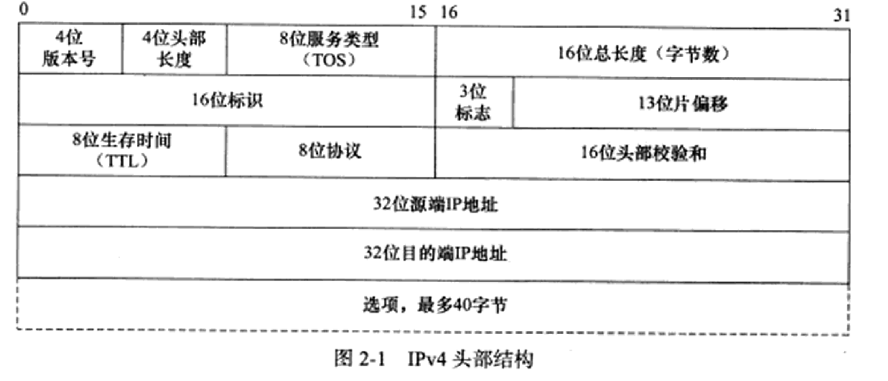

* 4位版本号（version）：

  指定IP协议的版本。对IPv4来说，其值是4.其他IPv4系欸的扩展版本（如SIP协议和PIP协议），则具有不同的版本号（它们的头部结构也和图2-1不同）

* 4位头部长度（header length）：

  标识该头部有多少个32bit字（4字节）。因为4位最大能表示15，所以ip头部最长是60字节。

* 8为服务类型（Type Of Service, TOS）：

  * 3位的优先权字段（现在已经被忽略）

  * 4位的TOS字段

    4位的TOS字段分别表示：最小延时，最大吞吐量，最高可靠性和最小费用。其中最多有一个能置为1，应用程序应该根据实际需要来设置它。比如像ssh和telnet这样的登录程序需要的是最小延时的服务，而文件传输程序ftp则需要最大吞吐量的服务。

  * 1位保留字段（必须置0）

* 16位总长度（total length）：

  指整个IP数据报的长度，以字节为单位，因此IP数据报的最大长度为65535（216-1）字节。但由于MTU的限制，长度超过MTU的数据报都将被分片传输，所以实际传输的IP数据报（或分片）的长度都远远没有达到最大值。

  接下来的3个字段则描述了如何实现分片。

* 16位标识（identification）

  唯一地标识主机发送的每一个数据报。其初始值由系统随机生成；每发送一个数据报，其值就加1。该值在数据报分片时被复制到每个分片中，因此同一个数据报的所有分片都具有相同的标识值。

* 3位标志字段：

  * 第一位保留

  * 第二位（Don’t Fragment，DF）表示“禁止分片”

    如果设置了这个位，IP模块将不对数据报进行分片。在这种情况下，如果IP数据报长度超过MTU的话，IP模块将丢弃该数据报并返回一个ICMP差错报文

  * 第三位（More Fragment，MF）表示“更多分片”

  * 除了数据报的最后一个分片外，其他分片都要把它置1

* 13位分片偏移（fragmentation offset）：

  是分片相对原始IP数据报开始处（仅指数据部分）的偏移。实际的偏移值是该值左移3位（乘8）后得到的。由于这个原因，除了最后一个IP分片外，每个IP分片的数据部分的长度必须是8的整数倍（这样才能保证后面的IP分片拥有一个合适的偏移值）。

* 8位生存时间（Time To Live，TTL）：

  是数据报到达目的地之前允许经过的路由器跳数。TTL值被发送端设置（常见的值是64）。数据报在转发过程中每经过一个路由，该值就被路由器减1。当TTL值减为0时，路由器将丢弃数据报，并向源端发送一个ICMP差错报文。TTL值可以防止数据报陷入路由循环。

* 8位协议（protocol）：

  用来区分上层协议，我们在第1章讨论过。/etc/protocols文件定义了所有上层协议对应的protocol字段的数值。其中，ICMP是1，TCP是6，UDP是17。/etc/protocols文件是RFC 1700的一个子集。

* 16位头部校验和（header checksum）：

  由发送端填充，接收端对其使用CRC算法以检验IP数据报头部（注意，仅检验头部）在传输过程中是否损坏。

* 32位的源端IP地址和目的端IP地址：

  用来标识数据报的发送端和接收端。一般情况下，这两个地址在整个数据报的传递过程中保持不变，而不论它中间经过多少个中转路由器。

* IPv4最后一个选项字段（option）是可变长的可选信息

  这部分最多包含40字节，因为IP头部最长是60字节（其中还包含前面讨论的20字节的固定部分）。可用的IP选项包括：

  * 记录路由（record route）：

    告诉数据报途经的所有路由器都将自己的IP地址填入IP头部的选项部分，这样我们就可以跟踪数据报的传递路径。

  * 时间戳（timestamp）：

    告诉每个路由器都将数据报被转发的时间（或时间与IP地址对）填入IP头部的选项部分，这样就可以测量途经路由之间数据报传输的时间。

  * 松散源路由选择（loose source routing）：

    指定一个路由器IP地址列表，数据报发送过程中必须经过其中所有的路由器。

  * 严格源路由选择（strict source routing）：

    和松散源路由选择类似，不过数据报只能经过被指定的路由器。

### 2.2.2 使用tcpdump观察IPv4头部结构

从测试机器ernest0laptop上执行telnet命令登陆本机，并用tcpdump抓取这个过程中telnet客户端和telnet服务器程序之间交换的数据包。具体操作如下：

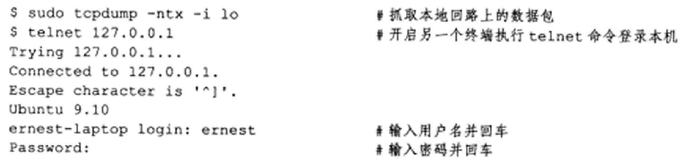

观察第一个数据包：

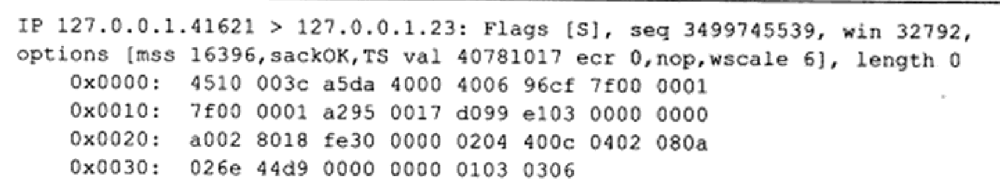

说明：

* telnet服务器程序使用的端口号是23（参见/etc/services文件），而telnet客户端程序使用临时端口号41621与服务器通信。
* "Flags"、“seq”、“win”和"options"描述的都是TCP头部信息
* “length”指出该ip数据包所携带的应用程序数据的长度

此数据包共包含60字节，其中前20字节是IP头部，后40字节是TCP头部，不包含应用程序数据（length值为0）。现在我们分析IP头部的每个字节，如表2-1所示：

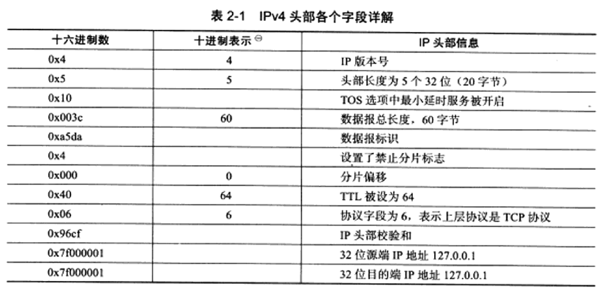

### 2.3 IP分片

<font color=red>当IP数据报的长度超过帧的MTU时，它将被分片传输。</font>分片可能发生在发送端，也可能发生在中转路由器上，而且可能在传输过程中被多次分片，但只有在最终目标机器上，这些分片才会被内核中的IP模块重新组装。

IP头部的如下<font color=red>三个字段给IP的分片和重组提供了足够的信息</font>：

* 数据报标识
* 标志
* 片偏移

一个IP数据报的每个分片都具有自己的IP头部，它们具有相同的标识值，但具有不同的片偏移。并且除了最后一个分片外，其他分片都将设置MF标志。

以太网的MTU时1500字节，携带的IP数据报的数据部分最多是1480字节（IP头部占用20字节）。

**例子： ICMP报文的分片**

用IP数据报封装一个长度为1481字节的ICMP报文（包括8字节的ICMP头部，所以其数据部分长度为1473字节），则该数据报在使用以太网帧传输时必须被分片，如图2-2所示：

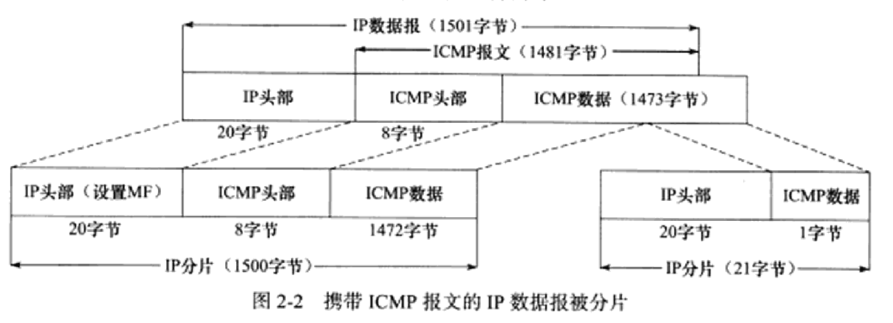

图2-2中，长度为1501字节的IP数据报被拆分成两个IP分片，第一个IP分片长度为1500字节，第二个IP分片的长度为21字节。每个IP分片都包含自己的IP头部（20字节），且第一个IP分片的IP头部设置了MF标志，而第二个IP分片的IP头部则没有设置该标志，因为它已经时最后一个分片了。原始IP数据报中的ICMP头部内容被完整地复制到了第一个IP分片中。第二个IP分片不需要包含再次包含IMCP头部信息。

ICMP报文的头部长度取决于报文的类型，其变化范围很大。图2-2以8字节为例，因为后面的例子用到了ping程序，而ping程序使用的ICMP回显和应答报文头部长度是8字节。

为了看清楚IP分片的具体过程，考虑从ernest-laptop来ping机器Kongming20，每次传送1473字节的数据（这是ICMP报文的数据部分）以强制引起IP分片，并用tcpdump抓取这一过程中双方交换的数据包。具体操作过程如下：

```
$ sudo tcpdump -ntv -i eth0 icmp        #只抓取ICMP报文
$ ping Kongming20 –s 1473            #用-s选项指定每次发送1473字节的数据
```

下面我们考察tcpdump输出的一个IP数据报的两个分片，其内容如下：

```t
1. IP(tos 0x0, ttl 64, id 61197, offset 0, flags [+], proto ICMP (1), length 1500)
     192.168.1.108 > 192.168.1.110: ICMP echo request, id 41737, seq 1, length 1480
2. IP(tos 0x0, ttl 64, id 61197, offset 1480, flags [none], proto ICMP (1), length 21)
     192.168.1.108 > 192.168.1.110: icmp
```

这两个IP分片的标识值都是61197，说明它们是同一个IP数据报的分片。第一个分片的片偏移值为0，而第二个则是1480。很显然，第二个分片的片偏移值实际上也是第一个分片的ICMP报文的长度。第一个分片设置了MF标志以表示还有后续分片，所以tcpdump输出“flags［+］”。而第二个分片则没有设置任何标志，所以tcpdump输出“flags［none］”。这个两个分片的长度分别为1500字节和21字节，这与图2-2描述的一致。

最后，IP层传递给数据链路层的数据可能是一个完整的IP数据报，也可能是一个IP分片，它们统称为IP分组（packet）。本书如无特殊声明，不区分IP数据报和IP分组。

### 2.4 IP路由

IP协议的一个<font color=red>核心任务</font>是数据报的路由，即决定发送数据报到目标机器的路径。

### 2.4.1 IP模块工作流程

IP模块的基本工作流程如图2-3所示：

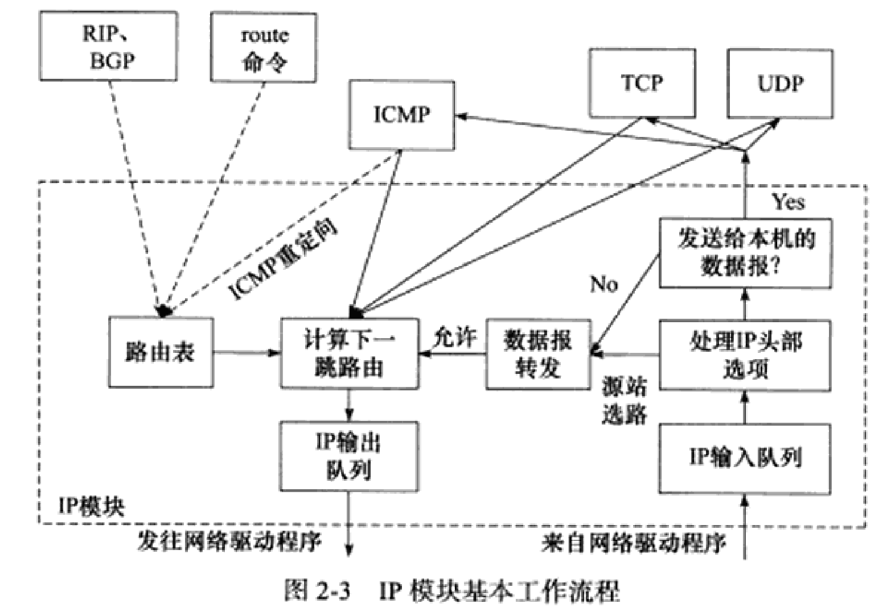

从右往左来分析图2-3。当IP模块接收到来自数据链路层的IP数据报时，它首先对该数据报的头部做CRC校验，确认无误之后就分析其头部的具体信息。

如果该IP数据报的头部设置了源站选路选项（松散源路由选择或严格源路由选择），则IP模块调用数据报转发子模块来处理该数据报。如果该IP数据报的头部中目标IP地址是本机的某个IP地址，或者是广播地址，即该数据报是发送给本机的，则IP模块就根据数据报头部中的协议字段来决定将它派发给哪个上层应用（分用）。如果IP模块发现这个数据报不是发送给本机的，则也调用数据报转发子模块来处理该数据报。

<font color=red>数据报转发子模块</font>将首先检测系统是否允许转发，如果不允许，IP模块就将数据报丢弃。如果允许，数据报转发子模块将对该数据报执行一些操作，然后将它交给IP数据报输出子模块。

**IP数据报应该发送至哪个下一跳路由（或者目标机器），以及经过哪个网卡来发送，就是<font color=red>IP路由过程</font>，即图2-3中“计算下一跳路由”子模块。**<font color=red>IP模块实现数据报路由的核心数据结构是路由表。</font>这个表按照数据报的目标IP地址分类，同一类型的IP数据报将被发往相同的下一跳路由器（或者目标机器）。

<font color=red>IP输出队列</font>中存放的是所有等待发送的IP数据报，其中除了需要转发的IP数据报外，还包括封装了本机上层数据（ICMP报文、TCP报文段和UDP数据报）的IP数据报。

图2-3中的虚线箭头显示了<font color=red>路由表更新的过程</font>。这一过程是指通过路由协议或者route命令调整路由表，使之更适应最新的网络拓扑结构，称为<font color=red>IP路由策略</font>。

### 2.4.2 路由机制

要研究IP路由机制，需要先了解<font color=red>路由表</font>的内容。

使用route命令或netstat命令查看路由表:

* 在测试机器ernest-laptop上执行route命令，输出内容如代码清单2-2所示。

```
Kernel IP routing table  
Destination    Gateway       Genmask        Flags   Metric   Ref     Use Iface  
default        192.168.1.1   0.0.0.0        UG      0        0       0   eth0  
192.168.1.0    *             255.255.255.0  U       1        0       0   eth0 
```

该路由表包含两项，每项都包含8个字段，如表2-2所示。

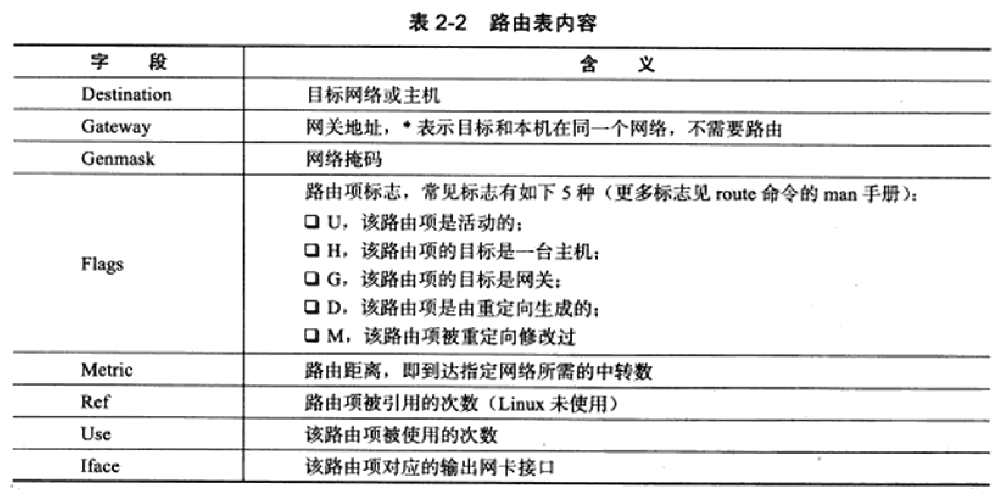

代码清单2-2所示的路由表中:

* 第一项的目标地址是default，即所谓的默认路由项。该项包含一个“G”标志，说明路由的下一跳目标是网关，其地址是192.168.1.1（这是测试网络中路由器的本地IP地址）。
* 另外一个路由项的目标地址是192.168.1.0，它指的是本地局域网。该路由项的网关地址为*，说明数据报不需要路由中转，可以直接发送到目标机器。

那么路由表是如何按照IP地址分类的呢？或者说给定数据报的目标IP地址，它将匹配路由表中的哪一项呢？这就是IP的<font color=red>路由机制</font>，分为3个步骤：

1）查找路由表中和数据报的目标IP地址完全匹配的主机IP地址。如果找到，就使用该路由项，没找到则转步骤2。

2）查找路由表中和数据报的目标IP地址具有相同网路ID的网络IP地址（比如代码清单2-2所示的路由表中的第二项）。如果找到，就使用该路由项；没找到则转步骤3。

3）选择默认路由项，这通常意味着数据报的下一跳路由是网关。

因此，对于测试机器ernest-laptop而言，所有发送到IP地址为192.168.1.*的机器的IP数据报都可以直接发送到目标机器（匹配路由表第二项），而所有访问因特网的请求都将通过网关来转发（匹配默认路由项）。

### 2.4.3 路由表更新

路由表必须能够更新 --> 以反映网络连接的变化 --> IP模块才能准确、高效地转发数据报。

route命令可以修改路由表。我们看如下几个例子（在机器ernest-laptop上执行）：

```shell
$ sudo route add –host 192.168.1.109 dev eth0  
表示添加主机192.168.1.109（机器Kongming20）对应的路由项。这样设置之后，所有从ernest-laptop发送到Kongming20的IP数据报将通过网卡eth0直接发送至目标机器的接收网卡。。

$ sudo route del -net 192.168.1.0 netmask 255.255.255.0  
表示删除网络192.168.1.0对应的路由项。这样，除了机器Kongming20外，测试机器ernest-laptop将无法访问该局域网上的任何其他机器（能访问到Kongming20是由于执行了上一条命令）

$ sudo route del default  
表示删除默认路由项，这样做的后果是无法访问因特网。

$ sudo route add default gw 192.168.1.109 dev eth0 
表示重新设置默认路由项，不过这次其网关是机器Kongming20（而不是能直接访问因特网的路由器）
```

经过上述修改后的路由表如下：

```
Kernel IP routing table  
Destination   Gateway       Genmask           Flags   Metric   Ref  Use Iface  
Kongming20    *             255.255.255.255   UH      0        0    0   eth0  
default       Kongming20    0.0.0.0           UG      0        0    0   eth0 
```

这个新的路由表中，第一个路由项是主机路由项，所以它被设置了“H”标志。我们设计这样一个路由表的目的是为后文讨论ICMP重定向提供环境。

通过route命令或其他工具手工修改路由表，是静态的路由更新方式。对于大型的路由器，它们通常通过BGP（Border Gateway Protocol，边际网关协议）、RIP（Routing Information Protocol，路由信息协议）、OSPF等协议来发现路径，并更新自己的路由表。这种更新方式是动态的、自动的。

### 2.5 IP转发

* 不是发送给本机的IP数据报将由数据报转发子模块来处理。

* 路由器都能执行数据报的转发操作，而主机一般只发送和接收数据报。

  可以通过修改内核的默认参数来使能主机的数据报转发功能：

```
sudo echo 1 > /proc/sys/net/ipv4/ip_forward 
```

数据报转发子模块将对期望转发的数据报执行如下操作：

* 检查数据报头部的TTL值。如果TTL值已经是0，则丢弃该数据报。
* 查看数据报头部的严格源路由选择选项。如果该选项被设置，则检测数据报的目标IP地址是否是本机的某个IP地址。如果不是，则发送一个ICMP源站选路失败报文给发送端。
* 如果有必要，则给源端发送一个ICMP重定向报文，以告诉它一个更合理的下一跳路由器。
* 将TTL值减1。
* 处理IP头部选项。
* 如果有必要，则执行IP分片操作。

### 2.6 重定向

图2-3显示了ICMP重定向报文也能用于更新路由表

#### 2.6.1 ICMP重定向报文

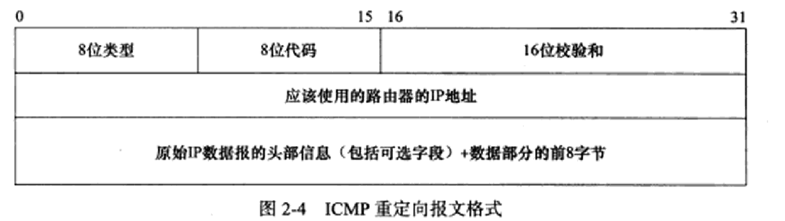

我们在1.1节讨论过ICMP报文头部的3个固定字段：

* 8位类型

  ICMP重定向报文的类型值是5，代码字段有4个可选值，用来区分不同的重定向类型。本书仅讨论主机重定向，其代码值为1。

* 8位代码

* 16位校验和

* ICMP重定向报文的数据部分含义很明确，它给接收方提供了如下两个信息：
  * 引起重定向的IP数据报（即图2-4中的原始IP数据报）的源端IP地址。
  * 应该使用的路由器的IP地址。

  接收主机根据这两个信息就可以断定引起重定向的IP数据报应该使用哪个路由器来转发，并且以此来更新路由表（通常是更新路由表缓冲，而不是直接更改路由表）。

/proc/sys/net/ipv4/conf/all/send_redirects内核参数指定是否允许发送ICMP重定向报文，而/proc/sys/net/ipv4/conf/all/accept_redirects内核参数则指定是否允许接收ICMP重定向报文。一般来说，主机只能接收ICMP重定向报文，而路由器只能发送ICMP重定向报文。

### 2.6.2 主机重定向实例

2.4.3节中，我们把机器ernest-laptop的网关设置成了机器Kongming20，2.5节中我们又使能了Kongming20的数据报转发功能，因此机器ernest-laptop将通过Kongming20来访问因特网，比如在ernest-laptop上执行如下ping命令：

```
$ ping www.baidu.com  
PING www.a.shifen.com (119.75.217.56) 56(84) bytes of data.  
From Kongming20 (192.168.1.109): icmp_seq=1 Redirect Host(New nexthop: 192.168.1.1)  
64 bytes from 119.75.217.56: icmp_seq=1 ttl=54 time=6.78 ms  
 
--- www.a.shifen.com ping statistics ---  
1 packets transmitted, 1 received, 0% packet loss, time 0ms  
rtt min/avg/max/mdev = 6.789/6.789/6.789/0.000 ms 
```

从ping命令的输出来看，Kongming20给ernest-laptop发送了一个ICMP重定向报文，告诉它请通过192.168.1.1来访问目标机器，因为这对ernest-laptop来说是更合理的路由方式。当主机ernest-laptop收到这样的ICMP重定向报文后，它将更新其路由表缓冲（使用命令route　-Cn查看），并使用新的路由方式来发送后续数据报。上面讨论的重定向过程可用图2-5来总结:

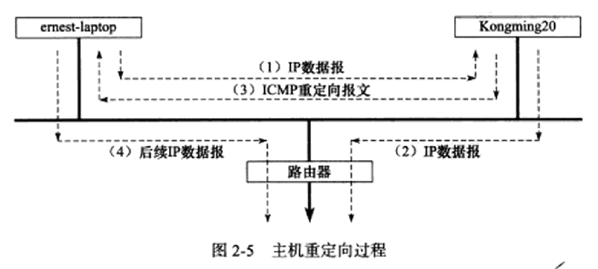

### 2.7 IPv6头部结构

略


## 第3章 TCP协议详解

从如下四方面来讨论TCP协议：

* TCP头部信息
* TCP状态转移过程
* TCP数据流
* TCP数据流的控制

### 3.1 TCP服务的特点

<font color=red>TCP: 面向列、字节流和可靠传输</font>

发送端执行的写操作次数和接收端执行的读操作次数之间没有任何数量关系，这就是字节流的概念，应用程序对数据的发送和接收是没有边界的。

UDP则不同，发送端应用程序每执行一次写操作，UDP模块就将其封装成一个UDP数据报并发送之。接受端必须及时针对每一个UDP数据报执行读操作（通过rcvfrom系统调用），否则就会丢报（这经常发生在较慢的服务器上）。并且，如果用户没有指定足够的应用程序缓冲区来读取UDP数据，则UDP数据将被截断。

下图显示了TCP字节流服务和UDP数据报服务的区别：

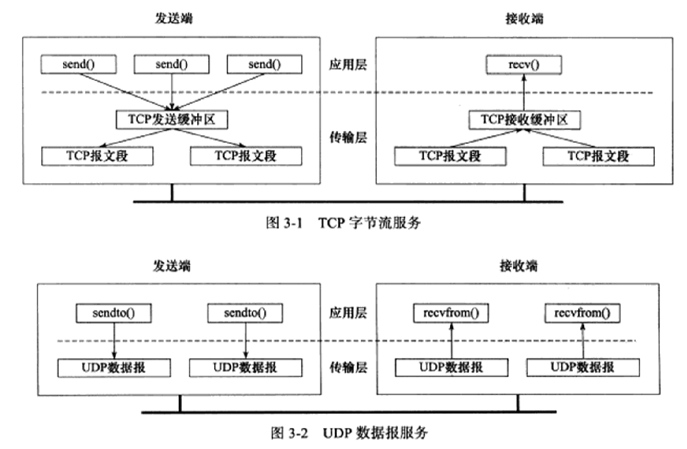

**TCP传输时可靠的:**

* 采用应答机制

  发送端发送的每个TCP报文都必须得到接收方的应答，才认为这个TCP报文段传输成功。

* 采用超时重传机制

  发送端在发送出一个TCP报文段之后启动定时器，如果在定时时间内未收到应答，它将重发该报文段。

* 重排、整理

  因为TCP报文段最终是以IP数据报发送的，而IP数据报到达接受端可能乱序、重复，所以TCP协议还会对接收到的TCP报文段重排、整理，再交付给应用层

### 3.2 TCP头部结构

TCP头部作用：

* 指定通信的源端端口、目的端端口
* 管理TCP连接等

本节介绍：

* 固定头部结构
* 头部选项

#### 3.2.1 TCP固定头部结构

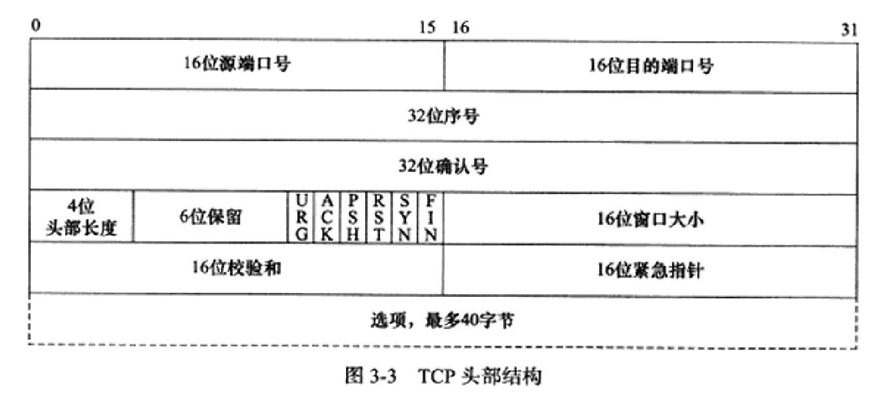

* 16位端口号（port number）

* 32位序号（sequence number）

  一次TCP通信（从TCP连接建立到断开）过程中某一个传输方向上的字节流的每个字节编号 。假设主机A和主机B进行TCP通信，A发送给B的第一个TCP报文段中，序号值被系统初始化位某个随机值ISN（Initial Sequence Number, 初始化序号值）。那么在该传输方向上（从A到B），后续的TCP报文段中序号值将被系统设置成ISN加上该报文段所携带数据的第一个字节在整个字节流中的偏移。例如，某个TCP报文段传送的数据是字节流中的第1025~2048字节，哪个该报文段的序号值就是ISN+1025。另外一个传输方向（从B到A）的TCP报文段的序号值也具有相同的含义

* 32位确认号（acknowledgement number）

  用作对另一方发送来的TCP报文段的响应。其值是收到的TCP报文段的序号值加1

* 4位头部长度（header length）

  标识该TCP头部有多少个32bit字（4字节）。因为4位最大能表示15，所以TCP头部最长是60字节。

* 6位标志位包含如下几项：

  * URG标志，表示紧急指针（urgent pointer）是否有效
  * ACK标志，表示确认号是否有效。我们称携带ACK标志的TCP报文段为确认报文段
  * PSH标志，提示接受端应用程序应该立即从TCP接受缓冲区读走数据，为接收后续数据腾出空间（如果应用程序不将接收到的数据读走，它们会一直停留在TCP接收缓冲区中）。
  * RST标志，表示要求对方重新建立连接。我们称携带RST标志的TCP报文端为复位报文段。
  * SYN标志，表示请求建立一个连接。我们称携带SYN标志的TCP报文段为同步报文段。
  * FIN标志，表示通知对方本端要关闭连接了。我们称携带FIN标志的TCP报文段为结束报文段。

* 16位窗口大小（window size）：是TCP流量控制的一个手段。

* 16位校验和（TCP checksum）：由发送端填充，接收端对TCP报文段执行CRC算法以检验TCP报文段在传输过程中是否损坏。注意，这个校验不仅包括TCP头部，也包括数据部分。

* 16位紧急指针（urgent pointer）：是一个正的偏移量。它和序号字段的值相加表示最后一个紧急数据的下一字节的序号。因此，确切的说，这个字段是紧急指针相对当前序号的偏移，不妨称之为紧急偏移。TCP的紧急指针式发送端向接收端发送紧急数据的方法。


#### 3.2.2 使用tcpdump观察TCP头部信息

在2.2.2节中，利用tcp抓到的一个数据包，本节分析其中与TCP协议相关的部分，代码清单如下：

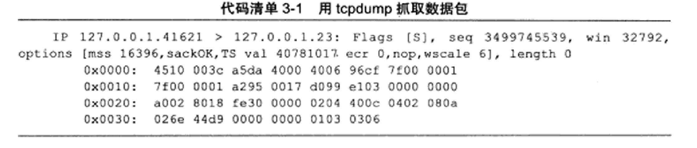

* Flags[S]，表示该TCP报文段包含SYN标志，因此它是一个同步报文段。
* seq是序号值，因为该同步报文段是从127.0.0.1.41621（客户端IP地址和端口号）到127.0.0.1.23（服务器IP地址和端口号）这个传输方向上的第一个TCP报文段，所以这个序号值也就是此次通信过程中该传输方向的ISN值。并且，因为这是整个通信过程中的第一个TCP报文段，所以它没有针对对方发送来的TCP报文段的确认值（尚未收到任何对方发送来的TCP报文段）。
* win是接收通告窗口的大小
* options是TCP选项

接下来分析tcpdump输出的字节码中TCP头部对应的信息，它从第21字节开始如表3-1所示：

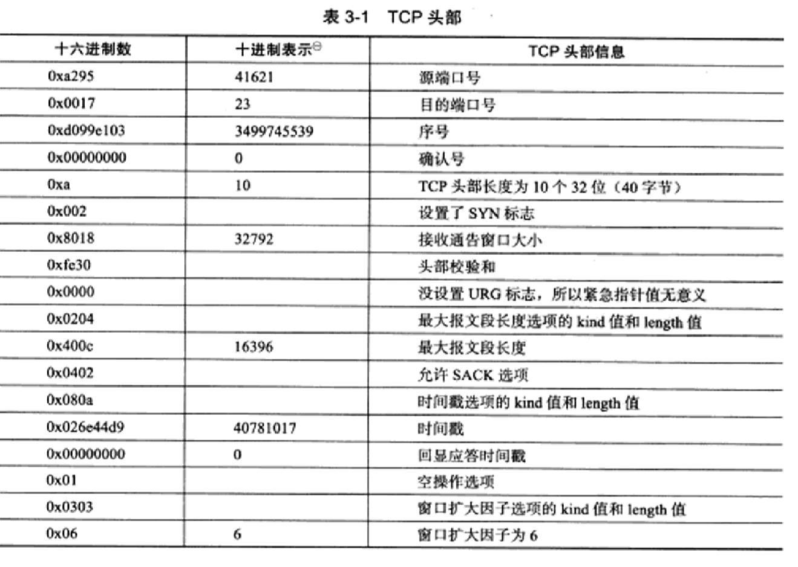

### 3.3 TCP连接的建立和关闭

#### 3.3.1 使用tcpdump观察TCP连接的建立和关闭

首先从ernest-laptop上执行telnet命令登录Kongming20的80端口，然后抓取这一过程中客户端和服务器交换的TCP报文段。具体操作过程如下

```
$ sudo tcpdump -i eth0 –nt '(src 192.168.1.109 and dst 192.168.1.108) or (src 192.168.1.108 and dst 192.168.1.109)'  
$ telnet 192.168.1.109 80  
Trying 192.168.1.109...  
Connected to 192.168.1.109.  
Escape character is '^]'.  
^]（回车）  # 输入ctrl+]并回车  
 
telnet> quit（回车）  
Connection closed. 
```

tcpdump输出的内容如代码清单3-2所示:

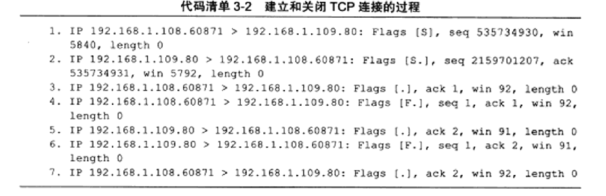

因为整个过程并没有发生应用层数据的交换，所以TCP报文段的数据部分的长度（length）总是0。

为了更清楚地表示建立和关闭TCP连接的整个过程，我们将tcpdump输出的内容绘制成图3-6所示的时序图:

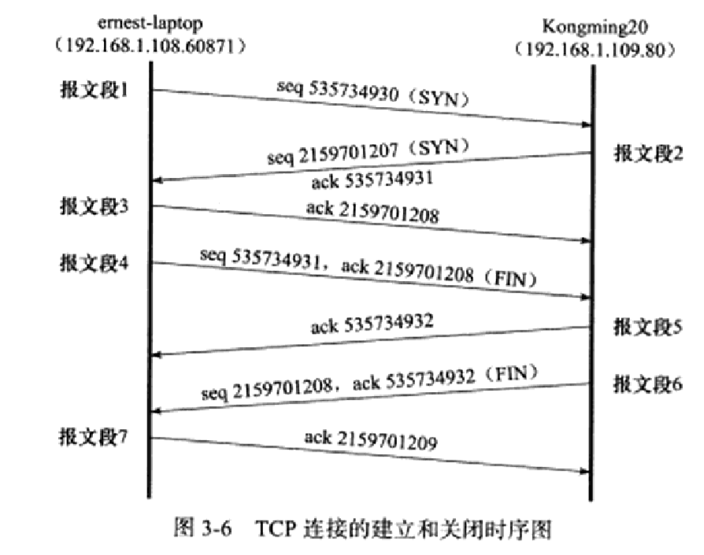

说明:

* 第1个TCP报文段包含SYN标志，因此它是一个同步报文段，即ernest-laptop（客户端）向Kongming20（服务器）发起连接请求。同时，该同步报文段包含一个ISN值为535734930的序号。

* 第2个TCP报文段也是同步报文段，表示Kongming20同意与ernest-laptop建立连接。同时它发送自己的ISN值为2159701207的序号，并对第1个同步报文段进行确认。确认值是535734931，即第1个同步报文段的序号值加1。前文说过，序号值是用来标识TCP数据流中的每一字节的。但同步报文段比较特殊，即使它并没有携带任何应用程序数据，它也要占用一个序号值。

* 第3个TCP报文段是ernest-laptop对第2个同步报文段的确认。至此，TCP连接就建立起来了。建立TCP连接的这3个步骤被称为TCP三次握手

  后面4个TCP报文段是关闭连接的过程:

* 第4个TCP报文段包含FIN标志，因此它是一个结束报文段，即ernest-laptop要求关闭连接。结束报文段和同步报文段一样，也要占用一个序号值。Kongming20用TCP报文段5来确认该结束报文段。紧接着Kongming20发送自己的结束报文段6，ernest-laptop则用TCP报文段7给予确认。实际上，仅用于确认目的的确认报文段5是可以省略的，因为结束报文段6也携带了该确认信息。确认报文段5是否出现在连接断开的过程中，取决于TCP的延迟确认特性。延迟确认将在后面讨论。 

在连接的关闭过程中，因为ernest-laptop先发送结束报文段（telnet客户端程序主动退出），故称ernest-laptop执行主动关闭，而称Kongming20执行被动关闭。

一般而言，TCP连接是由客户端发起，并通过三次握手建立（特殊情况是所谓同时打开［1］）的。TCP连接的关闭过程相对复杂一些。可能是客户端执行主动关闭，比如前面的例子；也可能是服务器执行主动关闭，比如服务器程序被中断而强制关闭连接；还可能是同时关闭（和同时打开一样，非常少见）。

#### 3.3.2 半关闭状态:

TCP连接是全双工的，所以它允许两个方向的数据传输被独立关闭。换言之，通信的一端可以发送结束报文段给对方，告诉它本端已经完成了数据的发送，但允许继续接收来自对方的数据，直到对方也发送结束报文段以关闭连接。TCP连接的这种状态称为<font color=red>半关闭（half close）状态</font>，如图3-7所示:

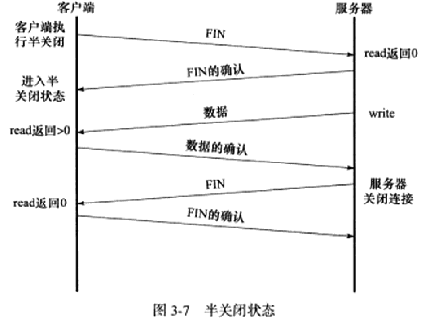

判断对方是否已经关闭连接的方法是：read系统调用返回0（收到结束报文段）。当然，Linux还提供其他检测连接是否被对方关闭的方法，这将在后续章节讨论。

socket网络编程接口通过shutdown函数提供了对半关闭的支持，我们将在后续章节讨论它。这里强调一下，虽然我们介绍了半关闭状态，但是使用半关闭的应用程序很少见。

#### 3.3.3 连接超时

如果客户端访问一个距离它很远的服务器，或者由于网络繁忙，导致服务器对于客户端发送出的同步报文段没有应答，此时客户端程序将产生什么样的行为呢？显然，对于提供可靠服务的TCP来说，它必然是先进行重连（可能执行多次），如果重连仍然无效，则通知应用程序连接超时。

模拟一个繁忙的服务器环境，在ernest-laptop上执行下面的操作:

```
$ sudo iptables -F  
$ sudo iptables -I INPUT -p tcp --syn -i eth0 -j DROP
```

iptable命令用于过滤数据包，这里我们利用它来丢弃所有接收到的连接请求（丢弃所有同步报文段，这样客户端就无法得到任何确认报文段）。

接下来从Kongming20上执行telnet命令登录到ernest-laptop，并用tcpdump抓取这个过程中双方交换的TCP报文段。具体操作如下：

```
$ sudo tcpdump -n -i eth0 port 23 #仅抓取telnet客户端和服务器交换的数据包  
$ date; telnet 192.168.1.108; date #在telnet命令前后都执行date命令，以计算超时时间  
Mon Jun 11 21:23:35 CST 2012  
Trying 192.168.1.108...  
telnet: connect to address 192.168.1.108: Connection timed out  
Mon Jun 11 21:24:38 CST 2012 
```

从两次date命令的输出来看，Kongming20建立TCP连接的超时时间是63s。本次tcpdump的输出如代码清单3-3所示:

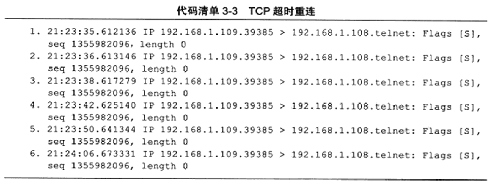

我们一共抓取到6个TCP报文段，它们都是同步报文段，并且具有相同的序号值，这说明后面5个同步报文段都是超时重连报文段。观察这些TCP报文段被发送的时间间隔，它们分别为1s、2s、4s、8s和16s（由于定时器精度的问题，这些时间间隔都有一定偏差），可以推断最后一个TCP报文段的超时时间是32s（63s-16s-8s-4s-2s-1s）。因此，TCP模块一共执行了5次重连操作，这是由/proc/sys/net/ipv4/tcp_syn_retries内核变量所定义的。每次重连的超时时间都增加一倍。在5次重连均失败的情况下，TCP模块放弃连接并通知应用程序。

 #### 3.4 TCP状态转移

TCP连接的任意一端在任一时刻都处于某种状态,当前状态可用通过netstat命令查看.

图3-8是完整的状态转移图,它描绘了所有的TCP状态以及可能的状态转换.

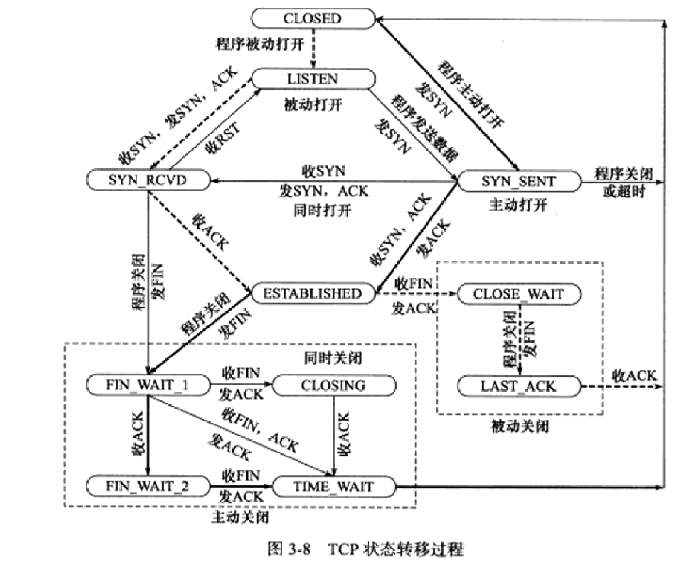

* 粗虚线表示典型的服务器端连接的状态转移
* 粗实线表示典型的客户端连接的状态转移
* CLOSED是一个假想的起始点,并不是一个实际的状态

##### 3.4.1 TCP状态转移总图

服务器端的状态:

服务器通过listen系统调用（见第5章）进入LISTEN状态，被动等待客户端连接，因此执行的是所谓的被动打开。服务器一旦监听到某个连接请求（收到同步报文段），就将该连接放入内核等待队列中，并向客户端发送带SYN标志的确认报文段。此时该连接处于SYN_RCVD状态。如果服务器成功地接收到客户端发送回的确认报文段，则该连接转移到ESTABLISHED状态。ESTABLISHED状态是连接双方能够进行双向数据传输的状态.

当客户端主动关闭连接时（通过close或shutdown系统调用向服务器发送结束报文段），服务器通过返回确认报文段使连接进入CLOSE_WAIT状态。这个状态的含义很明确：等待服务器应用程序关闭连接。通常，服务器检测到客户端关闭连接后，也会立即给客户端发送一个结束报文段来关闭连接。这将使连接转移到LAST_ACK状态，以等待客户端对结束报文段的最后一次确认。一旦确认完成，连接就彻底关闭了。


客户端的典型状态转移过程:

客户端通过connect系统调用（见第5章）主动与服务器建立连接。connect系统调用首先给服务器发送一个同步报文段，使连接转移到SYN_SENT状态。此后，connect系统调用可能因为如下两个原因失败返回：

* 如果connect连接的目标端口不存在（未被任何进程监听），或者该端口仍被处于TIME_WAIT状态的连接所占用（见后文），则服务器将给客户端发送一个复位报文段，connect调用失败。
* 如果目标端口存在，但connect在超时时间内未收到服务器的确认报文段，则connect调用失败。

connect调用失败将使连接立即返回到初始的CLOSED状态。如果客户端成功收到服务器的同步报文段和确认，则connect调用成功返回，连接转移至ESTABLISHED状态。

当客户端执行主动关闭时，它将向服务器发送一个结束报文段，同时连接进入FIN_WAIT_1状态。若此时客户端收到服务器专门用于确认目的的确认报文段（比如图3-6中的TCP报文段5），则连接转移至FIN_WAIT_2状态。当客户端处于FIN_WAIT_2状态时，服务器处于CLOSE_WAIT状态，这一对状态是可能发生半关闭的状态。此时如果服务器也关闭连接（发送结束报文段），则客户端将给予确认并进入TIME_WAIT状态。关于TIME_WAIT状态的含义，我们将在下一节讨论。

图3-8还给出了客户端从FIN_WAIT_1状态直接进入TIME_WAIT状态的一条线路（不经过FIN_WAIT_2状态），前提是处于FIN_WAIT_1状态的服务器直接收到带确认信息的结束报文段（而不是先收到确认报文段，再收到结束报文段）。这种情况对应于图3-6中的服务器不发送TCP报文段5。

前面说过，处于FIN_WAIT_2状态的客户端需要等待服务器发送结束报文段，才能转移至TIME_WAIT状态，否则它将一直停留在这个状态。如果不是为了在半关闭状态下继续接收数据，连接长时间地停留在FIN_WAIT_2状态并无益处。连接停留在FIN_WAIT_2状态的情况可能发生在：客户端执行半关闭后，未等服务器关闭连接就强行退出了。此时客户端连接由内核来接管，可称之为孤儿连接（和孤儿进程类似）。Linux为了防止孤儿连接长时间存留在内核中，定义了两个内核变量：/proc/sys/net/ipv4/tcp_max_orphans和/proc/sys/net/ipv4/tcp_fin_timeout。前者指定内核能接管的孤儿连接数目，后者指定孤儿连接在内核中生存的时间。

至此，我们简单地讨论了服务器和客户端程序的典型TCP状态转移路线。对应于图3-6所示的TCP连接的建立与断开过程，客户端和服务器的状态转移如图3-9所示:

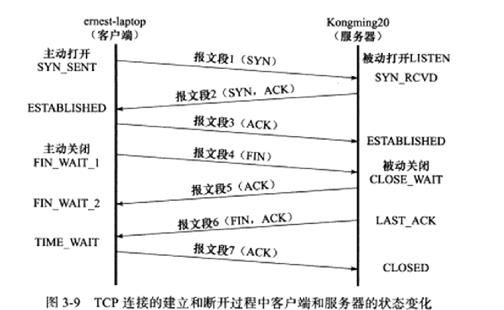

图3-8还描绘了其他非典型的TCP状态转移路线，比如同时关闭与同时打开，本书不予讨论。


##### 3.4.2 TIME_WAIT状态

从图3-9来看，客户端连接在收到服务器的结束报文段（TCP报文段6）之后，并没有直接进入CLOSED状态，而是转移到TIME_WAIT状态。在这个状态，客户端连接要等待一段长为2MSL（Maximum Segment Life，报文段最大生存时间）的时间，才能完全关闭。MSL是TCP报文段在网络中的最大生存时间，标准文档RFC 1122的建议值是2min。

TIME_WAIT状态存在的原因有两点：

* 可靠地终止TCP连接。

* 保证让迟来的TCP报文段有足够的时间被识别并丢弃。


### 3.5 复位报文段

在某些特殊条件下,TCP连接的一端会向另一端发送携带RST标志的报文段,即复位报文段,以通知对方关闭连接或重新建立连接.

本节讨论尝试复位报文段的3种情况:

#### 3.5.1 访问不存在的端口

当客户端程序访问一个不存在的端口时,目标主机将给它发送一个复位报文段.

例如:

> 从Kongming20上执行telnet命令登陆ernest-laptop上一个不存在的54321端口,并用tcpdump抓取该过程中两台主机交换的TCP报文段

具体操作如下:

```
$ sudo tcpdump -nt -i eth0 port 54321 #仅抓取发送至和来自54321端口的TCP报文段  
$ telnet 192.168.1.108 54321  
Trying 192.168.1.108...  
telnet: connect to address 192.168.1.108: Connection refused 
```

tcpdump抓到的TCP报文段内容如下:

```
1. IP 192.168.1.109.42001 > 192.168.1.108.54321: Flags [S], seq 21621375, win  
　  14600, length 0  
2. IP 192.168.1.108.54321 > 192.168.1.109.42001: Flags [R.], seq 0, ack  
　  21621376, win 0, length 0
```

ernest-laptop针对Kongming20的连接请求(同步报文段)回应了一个复位报文段(tcpdump输出R标志).因为复位报文段的接收通告窗口大小为0,所以可用遇见:收到报文段的一端应该关闭连接或者重新连接,而不能回应这个复位报文段.

实际上,当客户端程序向服务器的某个端口发起连接,而该端口仍被处于TIME_WAIT状态的连接所占用时,客户端程序也将收到复位报文段.

#### 3.5.2 异常终止连接

TCP提供异常终止一个连接的方法,即给对方发送一个复位报文段.一旦发送了复位报文段,发送端所有排队等待发送的数据都将被丢弃.应用程序可用使用socket选项SO_LINGER来发送复位报文段,以异常终止一个连接.

#### 3.5.3 处理半打开连接

考虑如下情况:

> 服务器（或客户端）关闭或者异常终止了连接，而对方没有接收到结束报文段（比如发生了网络故障），此时，客户端（或服务器）还维持着原来的连接，而服务器（或客户端）即使重启，也已经没有该连接的任何信息了。我们将这种状态称为半打开状态，处于这种状态的连接称为半打开连接。如果客户端（或服务器）往处于半打开状态的连接写入数据，则对方将回应一个复位报文段。

举例:

> 我们在Kongming20上使用nc命令模拟一个服务器程序，使之监听12345端口，然后从ernest-laptop运行telnet命令登录到该端口上，接着拔掉ernest-laptop的网线，并在Kongming20上中断服务器程序。显然，此时ernest-laptop上运行的telnet客户端程序维持着一个半打开连接。然后接上ernest-laptop的网线，并从客户端程序往半打开连接写入1字节的数据“a”。同时，运行tcpdump程序抓取整个过程中telnet客户端和nc服务器交换的TCP报文段。

具体操作如下:

```
$ nc –l 12345    #在Kongming20上运行服务器程序  
$ sudo tcpdump –nt –i eth0 port 12345  
$ telnet 192.168.1.109 12345  #在ernest-laptop上运行客户端程序  
Trying 192.168.1.109...  
Connected to 192.168.1.109.  
Escape character is '^]'.   #此时断开ernest-laptop的网线，并重启服务器  
a（回车）     #向半打开连接输入字符a  
Connection closed by foreign host. 
```

telnet的输出显示，连接被服务器关闭了。tcpdump抓取到的TCP报文段内容如下:

```
1. IP 192.168.1.108.55100 > 192.168.1.109.12345: Flags [S], seq 3093809365,  
　  length 0  
2. IP 192.168.1.109.12345 > 192.168.1.108.55100: Flags [S.], seq 1495337791,  
　  ack 3093809366, length 0  
3. IP 192.168.1.108.55100 > 192.168.1.109.12345: Flags [.], ack 1, length 0  
4. IP 192.168.1.108.55100 > 192.168.1.109.12345: Flags [P.], seq 1:4, ack 1,  
　  length 3  
5. IP 192.168.1.109.12345 > 192.168.1.108.55100: Flags [R], seq 1495337792,  
　  length 0 
```

该输出内容中，前3个TCP报文段是正常建立TCP连接的3次握手的过程。第4个TCP报文段由客户端发送给服务器，它携带了3字节的应用程序数据，这3字节依次是：字母“a”、回车符“\r”和换行符“\n”。不过因为服务器程序已经被中断，所以Kongming20对客户端发送的数据回应了一个复位报文段5。

### 3.6 TCP交互数据流

TCP报文段所携带的应用程序数据按照长度分为两种:

* 交互数据

  交互数据仅包含很少的字节,使用交互数据的应用程序(或协议)对实时性要求很高,比如:telnet、ssh等

* 成块数据

  成块数据的长度则通常为TCP报文段允许的最大数据长度,使用成块数据的应用程序(或应用)对传输效率要求高,比如ftp.

本节我们讨论交互数据流:

> 在ernest-laptop上执行telnet命令登录到本机，然后在shell命令提示符后执行ls命令，同时用tcpdump抓取这一过程中telnet客户端和telnet服务器交换的TCP报文段.

具体操作过程如下：

```
$ tcpdump –nt –i lo port 23  
$ telnet 127.0.0.1  
Trying 127.0.0.1...  
Connected to 127.0.0.1.  
Escape character is '^]'.  
Ubuntu 9.10  
ernest-laptop login: ernest（回车） #输入用户名并回车  
Password:（回车）    #输入密码并回车  
 
ernest@ernest-laptop:~$ ls（回车） 
```

上述过程将引起客户端和服务器交换很多TCP报文段。下面我们仅列出我们感兴趣的、执行ls命令产生的tcpdump输出:

```
1. IP 127.0.0.1.58130 > 127.0.0.1.23: Flags [P.], seq 1408334812:1408334813,  
　  ack 1415955507, win 613, length 1  
2. IP 127.0.0.1.23 > 127.0.0.1.58130: Flags [P.], seq 1:2, ack 1, win 512,  
　  length 1  
3. IP 127.0.0.1.58130 > 127.0.0.1.23: Flags [.], ack 2, win 613, length 0  
4. IP 127.0.0.1.58130 > 127.0.0.1.23: Flags [P.], seq 1:2, ack 2, win 613,  
　  length 1  
5. IP 127.0.0.1.23 > 127.0.0.1.58130: Flags [P.], seq 2:3, ack 2, win 512,  
　  length 1  
6. IP 127.0.0.1.58130 > 127.0.0.1.23: Flags [.], ack 3, win 613, length 0  
7. IP 127.0.0.1.58130 > 127.0.0.1.23: Flags [P.], seq 2:4, ack 3, win 613,  
　  length 2  
8. IP 127.0.0.1.23 > 127.0.0.1.58130: Flags [P.], seq 3:176, ack 4, win 512,  
  length 173  
9. IP 127.0.0.1.58130 > 127.0.0.1.23: Flags [.], ack 176, win 630, length 0  
10. IP 127.0.0.1.23 > 127.0.0.1.58130: Flags [P.], seq 176:228, ack 4, win 512,  
　 　length 52  
11. IP 127.0.0.1.58130 > 127.0.0.1.23: Flags [.], ack 228, win 630, length 0
```

TCP报文段1由客户端发送给服务器，它携带1个字节的应用程序数据，即字母“l”。TCP报文段2是服务器对TCP报文段1的确认，同时回显字母“l”。TCP报文段3是客户端对TCP报文段2的确认。第4～6个TCP报文段是针对字母“s”的上述过程。TCP报文段7传送的2字节数据分别是：客户端键入的回车符和流结束符（EOF，本例中是0x00）。TCP报文段8携带服务器返回的客户查询的目录的内容（ls命令的输出），包括该目录下文件的文件名及其显示控制参数。TCP报文段9是客户端对TCP报文段8的确认。TCP报文段10携带的也是服务器返回给客户端的数据，包括一个回车符、一个换行符、客户端登录用户的PS1环境变量（第一级命令提示符）。TCP报文段11是客户端对TCP报文段10的确认。

在上述过程中，客户端针对服务器返回的数据所发送的确认报文段（TCP报文段6、9和11）都不携带任何应用程序数据（长度为0），而服务器每次发送的确认报文段（TCP报文段2、5、8和10）都包含它需要发送的应用程序数据。服务器的这种处理方式称为<font color=red>延迟确认</font>，即它不马上确认上次收到的数据，而是在一段延迟时间后查看本端是否有数据需要发送，如果有，则和确认信息一起发出。因为服务器对客户请求处理得很快，所以它发送确认报文段的时候总是有数据一起发送。延迟确认可以减少发送TCP报文段的数量。而由于用户的输入速度明显慢于客户端程序的处理速度，所以客户端的确认报文段总是不携带任何应用程序数据。前文曾提到，在TCP连接的建立和断开过程中，也可能发生延迟确认。

上例是在本地回路运行的结果，在局域网中也能得到基本相同的结果，但在广域网就未必如此了。广域网上的交互数据流可能经受很大的延迟，并且，携带交互数据的微小TCP报文段数量一般很多（一个按键输入就导致一个TCP报文段），这些因素都可能导致拥塞发生。解决该问题的一个简单有效的方法是使用Nagle算法。

<font color=red>Nagle算法</font>要求一个TCP连接的通信双方在任意时刻都最多只能发送一个未被确认的TCP报文段，在该TCP报文段的确认到达之前不能发送其他TCP报文段。另一方面，发送方在等待确认的同时收集本端需要发送的微量数据，并在确认到来时以一个TCP报文段将它们全部发出。这样就极大地减少了网络上的微小TCP报文段的数量。该算法的另一个优点在于其自适应性：确认到达得越快，数据也就发送得越快。

### 3.7 TCP成块数据流

例子:用FTP协议传输一个大文件:

> 在ernest-laptop上启动一个vsftpd服务器程序（升级的、安全版的ftp服务器程序），并执行ftp命令登录该服务器上，然后在ftp命令提示符后输入get命令，从服务器下载一个几百兆的大文件。同时用tcpdump抓取这一个过程中ftp客户端和vsftpd服务器交换的TCP报文段

具体操作过程如下：

```
$ sudo tcpdump –nt –i eth0 port 20  # vsftpd服务器程序使用端口号20  
$ ftp 127.0.0.1  
Connected to 127.0.0.1.  
220 (vsFTPd 2.3.0)  
Name (127.0.0.1:ernest): ernest（回车）  #输入用户名并回车  
331 Please specify the password.  
Password:（回车）     #输入密码并回车  
230 Login successful.  
Remote system type is UNIX.  
Using binary mode to transfer files.  
ftp> get bigfile（回车）     #获取大文件bigfile 
```

抓取到的数据:
```
1. IP 127.0.0.1.20 > 127.0.0.1.39651: Flags [.], seq 205783041:205799425, ack 1,  
　  win 513, length 16384  
2. IP 127.0.0.1.20 > 127.0.0.1.39651: Flags [.], seq 205799425:205815809, ack 1,  
　  win 513, length 16384  
3. IP 127.0.0.1.20 > 127.0.0.1.39651: Flags [.], seq 205815809:205832193, ack 1,  
　  win 513, length 16384  
4. IP 127.0.0.1.20 > 127.0.0.1.39651: Flags [P.], seq 205832193:205848577, ack  
　  1, win 513, length 16384  
5. IP 127.0.0.1.20 > 127.0.0.1.39651: Flags [.], seq 205848577:205864961, ack 1,  
　  win 513, length 16384  
6. IP 127.0.0.1.20 > 127.0.0.1.39651: Flags [.], seq 205864961:205881345, ack 1,  
　  win 513, length 16384  
7. IP 127.0.0.1.20 > 127.0.0.1.39651: Flags [.], seq 205881345:205897729, ack 1,  
　  win 513, length 16384  
8. IP 127.0.0.1.20 > 127.0.0.1.39651: Flags [P.], seq 205897729:205914113, ack  
　  1, win 513, length 16384  
9. IP 127.0.0.1.20 > 127.0.0.1.39651: Flags [.], seq 205914113:205930497, ack 1,  
　  win 513, length 16384  
10. IP 127.0.0.1.20 > 127.0.0.1.39651: Flags [.], seq 205930497:205946881, ack  
 1, win 513, length 16384  
11. IP 127.0.0.1.20 > 127.0.0.1.39651: Flags [.], seq 205946881:205963265, ack  
 1, win 513, length 16384  
12. IP 127.0.0.1.20 > 127.0.0.1.39651: Flags [P.], seq 205963265:205979649, ack  
 1, win 513, length 16384  
13. IP 127.0.0.1.20 > 127.0.0.1.39651: Flags [.], seq 205979649:205996033, ack  
 1, win 513, length 16384  
14. IP 127.0.0.1.20 > 127.0.0.1.39651: Flags [.], seq 205996033:206012417, ack  
 1, win 513, length 16384  
15. IP 127.0.0.1.20 > 127.0.0.1.39651: Flags [.], seq 206012417:206028801, ack  
 1, win 513, length 16384  
16. IP 127.0.0.1.20 > 127.0.0.1.39651: Flags [P.], seq 206028801:206045185, ack  
 1, win 513, length 16384  
17. IP 127.0.0.1.39651 > 127.0.0.1.20: Flags [.], ack 205815809, win 30084,  
 length 0  
18. IP 127.0.0.1.39651 > 127.0.0.1.20: Flags [.], ack 206045185, win 27317,  
 length 0 
```

注意，客户端发送的最后两个TCP报文段17和18，它们分别是对TCP报文段2和16的确认（从序号值和确认值来判断）。由此可见，当传输大量大块数据的时候，发送方会连续发送多个TCP报文段，接收方可以一次确认所有这些报文段。那么发送方在收到上一次确认后，能连续发送多少个TCP报文段呢？这是由接收通告窗口（还需要考虑拥塞窗口，见后文）的大小决定的。TCP报文段17说明客户端还能接收30084×64字节（本例中窗口扩大因子为6），即1925376字节的数据。而在TCP报文段18中，接收通告窗口大小为1748288字节，即客户端能接收的数据量变小了。这表明客户端的TCP接收缓冲区有更多的数据未被应用程序读取而停留在其中，这些数据都来自TCP报文段3～16中的一部分。服务器收到TCP报文段18后，它至少（因为接收通告窗口可能扩大）还能连续发送的未被确认的报文段数量是1748288/16384个，即106个（但一般不会连续发送这么多）。其中，16384是成块数据的长度（见TCP报文段1～16的length值），很显然它小于但接近MSS规定的16396字节。

另外一个值得注意的地方是，服务器每发送4个TCP报文段就传送一个PSH标志（tcpdump输出标志P）给客户端，以通知客户端的应用程序尽快读取数据。不过这对服务器来说显然不是必需的，因为它知道客户端的TCP接收缓冲区中还有空闲空间（接收通告窗口大小不为0）。

>下面我们修改系统的TCP接收缓冲区和TCP发送缓冲区的大小（如何修改将在第16章介绍），使之都为4096字节，然后重启vsftpd服务器，并再次执行上述操作

此次tcpdump的部分输出如代码清单3-6所示:

```
1. IP 127.0.0.1.20 > 127.0.0.1.45227: Flags [.], seq 5195777:5197313, ack 1,  
　  win 3072, length 1536  
2. IP 127.0.0.1.20 > 127.0.0.1.45227: Flags [.], seq 5197313:5198849, ack 1,  
　  win 3072, length 1536  
3. IP 127.0.0.1.45227 > 127.0.0.1.20: Flags [.], ack 5198849, win 3072, length 0  
4. IP 127.0.0.1.20 > 127.0.0.1.45227: Flags [P.], seq 5198849:5200385, ack 1,  
　  win 3072, length 1536  
5. IP 127.0.0.1.45227 > 127.0.0.1.20: Flags [.], ack 5200385, win 3072, length 0 
```

从同步报文段（未在代码清单3-6中列出）得知在这次通信过程中，客户端和服务器的窗口扩大因子都为0，因而客户端和服务器每次通告的窗口大小都是3072字节（没超过4096字节，预料之中）。因为每个成块数据的长度为1536字节，所以服务器在收到上一个TCP报文段的确认之前最多还能再发送1个TCP报文段，这正是TCP报文段1～3描述的情形。

### 3.8 带外数据

略

### 3.9 TCP超时重传

TCP服务必须能够重传超时时间内未收到确认的TCP报文段。为此，TCP模块未每个TCP报文段都维护一个重传定时器，该定时器在TCP报文段第一i此被发送时启动。如果超时时间内未收到接收方的应答，TCP模块将重传TCP报文段并重置定时器。

例子：

> 在ernest-laptop上启动iperf服务器程序，然后从Kongming20上执行telnet命令登录该服务器程序。接下来，从telnet客户端发送一些数据（此处是“1234”）给服务器，然后断开服务器的网线并再次从客户端发送一些数据给服务器（此处是“12”）。同时，用tcpdump抓取这一过程中客户端和服务器交换的TCP报文段。

具体操作过程：

```
$ sudo tcpdump -n -i eth0 port 5001  
$ iperf –s     #在ernest-laptop上执行  
$ telnet 192.168.1.108 5001  #在Kongming20上执行  
Trying 192.168.1.108...  
Connected to 192.168.1.108.  
Escape character is '^]'.  
1234     #发送完之后断开服务器网线  
12  
Connection closed by foreign host 
```

iperf是一个测量网络状况的工具，-s选项表示将其作为服务器运行。iperf默认监听5001端口，并丢弃该端口上接收到的所有数据，相当于一个discard服务器。

上述操作过程的部分tcpdump输出如代码清单3-7所示:

```
1. 18:44:57.580341 IP 192.168.1.109.38234 > 192.168.1.108.5001: Flags [S], seq  
　  2381272950, length 0  
2. 18:44:57.580477 IP 192.168.1.108.5001 > 192.168.1.109.38234: Flags [S.], seq  
　  466032301, ack 2381272951, length 0  
3. 18:44:57.580498 IP 192.168.1.109.38234 > 192.168.1.108.5001: Flags [.], ack  
　  1, length 0  
4. 18:44:59.866019 IP 192.168.1.109.38234 > 192.168.1.108.5001: Flags [P.], seq  
　  1:7, ack 1, length 6  
5. 18:44:59.866165 IP 192.168.1.108.5001 > 192.168.1.109.38234: Flags [.], ack  
　  7, length 0  
6. 18:45:25.028933 IP 192.168.1.109.38234 > 192.168.1.108.5001: Flags [P.], seq  
　  7:11, ack 1, length 4  
7. 18:45:25.230034 IP 192.168.1.109.38234 > 192.168.1.108.5001: Flags [P.], seq  
　  7:11, ack 1, length 4  
8. 18:45:25.639407 IP 192.168.1.109.38234 > 192.168.1.108.5001: Flags [P.], seq  
　  7:11, ack 1, length 4  
9. 18:45:26.455942 IP 192.168.1.109.38234 > 192.168.1.108.5001: Flags [P.], seq  
　  7:11, ack 1, length 4  
10. 18:45:28.092425 IP 192.168.1.109.38234 > 192.168.1.108.5001: Flags [P.],  
 seq 7:11, ack 1, length 4  
11. 18:45:31.362473 IP 192.168.1.109.38234 > 192.168.1.108.5001: Flags [P.],  
 seq 7:11, ack 1, length 4  
12. 18:45:33.100888 ARP, Request who-has 192.168.1.108 tell 192.168.1.109,  
 length 28  
13. 18:45:34.098156 ARP, Request who-has 192.168.1.108 tell 192.168.1.109,  
 length 28  
14. 18:45:35.100887 ARP, Request who-has 192.168.1.108 tell 192.168.1.109,  
 length 28  
15. 18:45:37.902034 ARP, Request who-has 192.168.1.108 tell 192.168.1.109,  
 length 28  
16. 18:45:38.903126 ARP, Request who-has 192.168.1.108 tell 192.168.1.109,  
 length 28  
17. 18:45:39.901421 ARP, Request who-has 192.168.1.108 tell 192.168.1.109,  
 length 28  
18. 18:45:44.440049 ARP, Request who-has 192.168.1.108 tell 192.168.1.109,  
 length 28  
19. 18:45:45.438840 ARP, Request who-has 192.168.1.108 tell 192.168.1.109,  
 length 28  
20. 18:45:46.439932 ARP, Request who-has 192.168.1.108 tell 192.168.1.109,  
 length 28  
21. 18:45:50.976710 ARP, Request who-has 192.168.1.108 tell 192.168.1.109,  
 length 28  
22. 18:45:51.974134 ARP, Request who-has 192.168.1.108 tell 192.168.1.109,  
 length 28  
23. 18:45:52.973939 ARP, Request who-has 192.168.1.108 tell 192.168.1.109,  
 length 28 
```

* TCP报文段1～3是三次握手建立连接的过程
* TCP报文段4～5是客户端发送数据“1234”（应用程序数据长度为6，包括回车、换行两个字符，后同）及服务器确认的过程。
* TCP报文段6是客户端第一次发送数据“12”的过程。因为服务器的网线被断开，所以客户端无法收到TCP报文段6的确认报文段。此后，客户端对TCP报文段6执行了5次重传，它们是TCP报文段7～11，这可以从每个TCP报文段的序号得知。
* 此后，数据包12～23都是ARP模块的输出内容，即Kongming20查询ernest-laptop的MAC地址。

观察TCP报文段6～11被发送的时间间隔，它们分别为0.2s、0.4s、0.8s、1.6s和3.2s。由此可见，TCP一共执行5次重传，每次重传超时时间都增加一倍（因此，和TCP超时重连的策略相似）。在5次重传均失败的情况下，底层的IP和ARP开始接管，直到telnet客户端放弃连接为止。

**Linux有两个重要的内核参数与TCP超时重传相关：**

* /proc/sys/net/ipv4/tcp_retries1

  指定在底层IP接管之前TCP最少执行的重传次数，默认值是3。

* /proc/sys/net/ipv4/tcp_retries2。

  指定连接放弃前TCP最多可以执行的重传次数，默认值是15（一般对应13～30min）。

在我们的实例中，TCP超时重传发生了5次，连接坚持的时间是15min（可以用date命令来测量）

### 3.10 拥塞控制

#### 3.10.1 拥塞控制概述

TCP模块还有一个重要的任务，就是提高网络利用率，降低丢包率，并保证网络资源对每条数据流的公平性。这就是所谓的拥塞控制。

TCP拥塞控制的标准文档是RFC 5681。

**拥塞控制的四个部分：**

* 慢启动（slow start）
* 拥塞避免（congestion avoidance）
* 快速重传（fast retransmit）
* 快速恢复（fast recovery）

拥塞控制算法在Linux下有多种实现，如reno算法、vegas算法和cubic算法等。/proc/sys/net/ipv4/tcp_congestion_control文件指示机器当前所使用的拥塞控制算法。

拥塞控制的最终受控变量是发送端向网络一次连续写入（收到其中第一个数据的确认之前）的数据量，我们称为<font color=red>SWND（Send Window，发送窗口）</font>。不过，发送端最终以TCP报文段来发送数据，所以SWND限定了发送端能连续发送的TCP报文段数量。这些TCP报文段的最大长度（仅指数据部分）称为<font color=red>SMSS（Sender Maximum Segment Size，发送者最大段大小）</font>，其值一般等于MSS。

**发送端需要合理地选择SWND的大小。如果SWND太小，会引起明显的网络延迟；反之，如果SWND太大，则容易导致网络拥塞。**

前文提到，接收方可通过其接收通告窗口（RWND）来控制发送端的SWND。但这显然不够，所以发送端引入了一个称为拥塞窗口（Congestion Window，CWND）的状态变量。实际的SWND值是RWND和CWND中的较小者。图3-11显示了拥塞控制的输入和输出（可见，它是一个闭环反馈控制）。

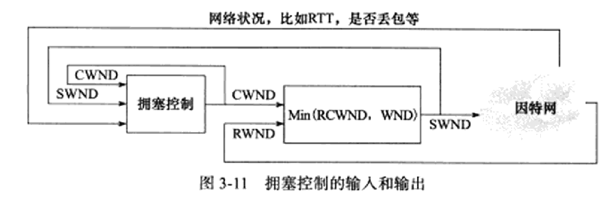

#### 3.10.2 慢启动和拥塞避免

略

#### 3.10.3 快速重传和快速恢复

略


## 第4章 TCP/IP通信案例： 访问Internet上的Web服务器

### 4.1 实例总图

在Kongming20上允许wget客户端程序，在ernest-laptop上允许squid代理服务器程序。客户端通过代理服务器的中转，获取Internet上的主机www.baidu.com的首页文档idex.html

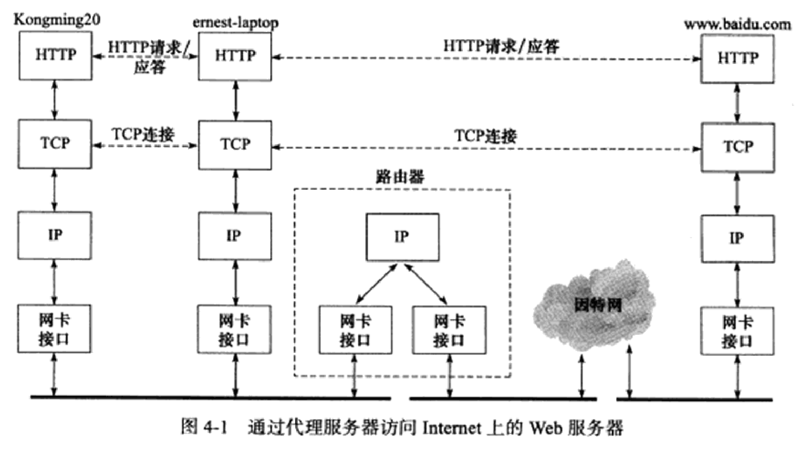

为了将ernest-latop设置为Kongming20的HTTP代理服务器，我们需要在Kongming20上设置环境变量http_proxy:

```
$export http_proxy="ernest-laptop:3128" # 在Kongming20上执行
```

### 4.2 部署代理服务器

#### 4.2.1 HTTP代理服务器的工作原理

一个HTTP请求可能被多个代理服务器转发，后面的服务器称为前面服务器的<font color=red>上游服务器</font>。

代理服务器按照其使用方式和作用，分为:

* 正向代理服务器

  要求客户端自己设置代理服务器的地址。客户的每次请求都将直接发送到该代理服务器，并由代理服务器请求目标资源。比如处于防火墙内的局域网机器要访问Internet，或者要访问一些被屏蔽掉的国外网站，就需要使用正向代理服务器

* 反向代理服务器

  反向代理则被设置在服务器端，因而客户端无需进行任何设置。反向代理是指用代理服务器来接收Internet上的连接请求，然后将请求转发给内部网络上的服务器，并将从内部服务器上得到的结果返回给客户端。这种情况下，代理服务器对外就表现为一个真实的服务器。各大网站通常分区域设置了多个代理服务器，所以在不同的地方ping同一个域名可能得到不同的IP地址，因为这些IP地址实际上是代理服务器的IP地址。

* 透明代理服务器

  透明代理只能设置在网关上。用户访问Internet的数据报必然都经过网关，如果在网关上设置代理，则该代理对用户来说显然是透明的。透明代理可以看作正向代理的一种特殊情况。

图4-2显示了正向代理服务器和反向代理服务器在HTTP通信链上的逻辑位置：

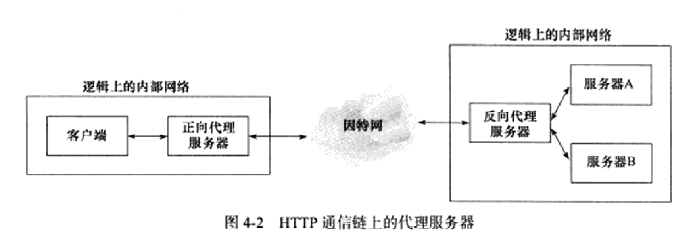

如图所示，正向代理服务器和客户端主机处于同一个逻辑网络中。该逻辑网络可以是一个本地LAN，也可以是一个更大的网络。反向代理服务器和真正的Web服务器也位于同一个逻辑网络中，这通常由提供网站的公司来配置和管理。

代理服务器通常还提供**缓存目标资源**的功能，这样用户下次访问同一资源时速度将很快。优秀的开源软件squid，varnish都是提供了缓存能力的代理服务器软件，其中squid支持所有代理方式，而varnish仅能用作反向代理。


#### 4.2.2 部署squid代理服务器

略


### 4.3 使用tcpdump抓取传输数据包

在执行wget命令前，我们首先应删除ernest-laptop的ARP高速缓存中路由器对应的项，以便观察TCP/IP通信过程中ARP协议何时其作用。

完整的操作过程:

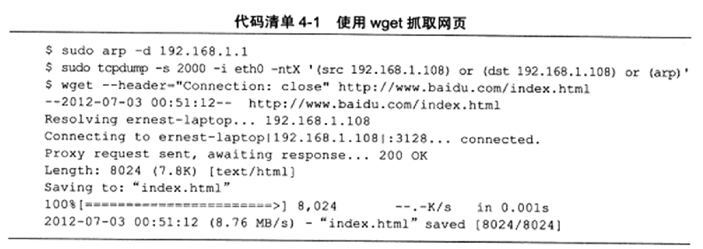

wget命令的输出显示，HTTP请求确实是先被送至代理服务器的3128端口，并且代理服务器正确地返回了文件index.html的内容

这次通信的完整tcpduamp输出内容如代码清单4-2所示：

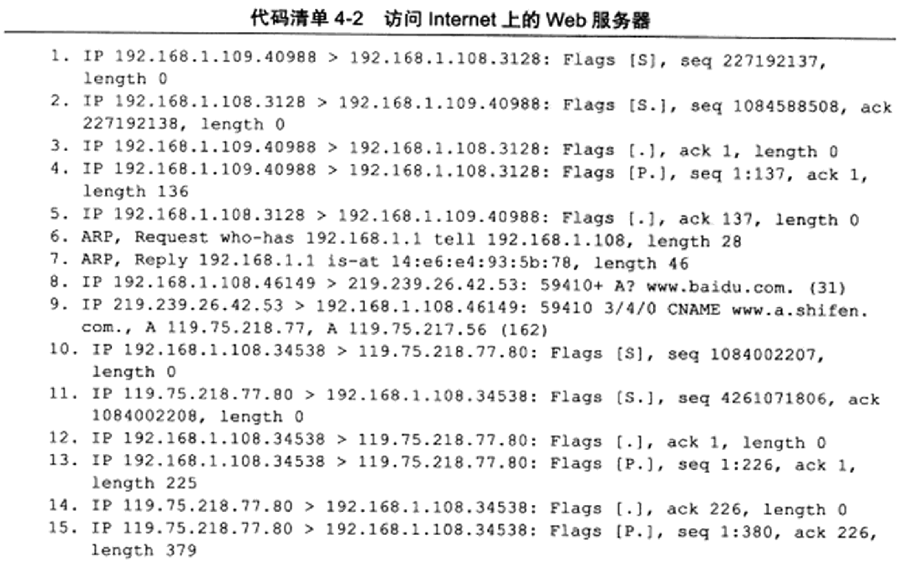

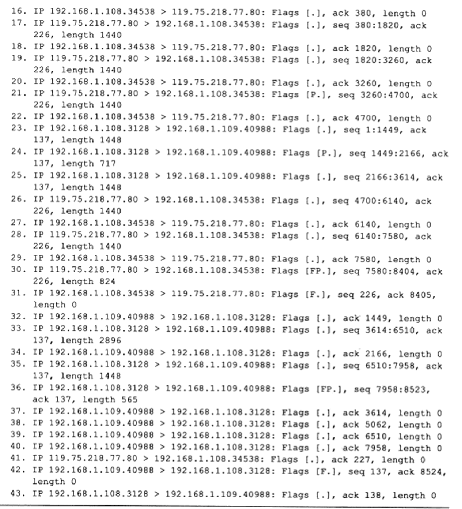

我们一共抓取了43个数据包。此次是两队客户端和服务器（wget客户端和代理服务器，以及代理服务器和目标web服务器）之间通信的全部内容。

将这43个数据包按照其逻辑关系分为4个部分:

* 代理服务器分为DNS服务器以查询域名www.baidu.com对应的IP地址，包括数据8、9
* 代理服务器查询路由器MAC地址的ARP请求和应答，包括数据包6、7
* wget客户端（192.168.1.109）和代理服务器（192.168.1.108）之间的HTTP通信，包括数据包1~5、23~25、32~40、42和43
* 代理服务器和Web服务器（119.75.218.77）之间的HTTP通信，包括数据包10~22，26~31和41

### 4.4 访问DNS服务器

数据包8、9表示代理服务器ernest-laptop向DNS服务器（219.239.26.42，首选DNS服务器的IP地址，见1.62节）查询域名www.baidu.com对应的IP地址，并得到了回复。该回复包括一个主机别名（www.a.shifeng.com）和两个IP地址。

代理服务器执行DNS查询的完整过程如图4-3所示：

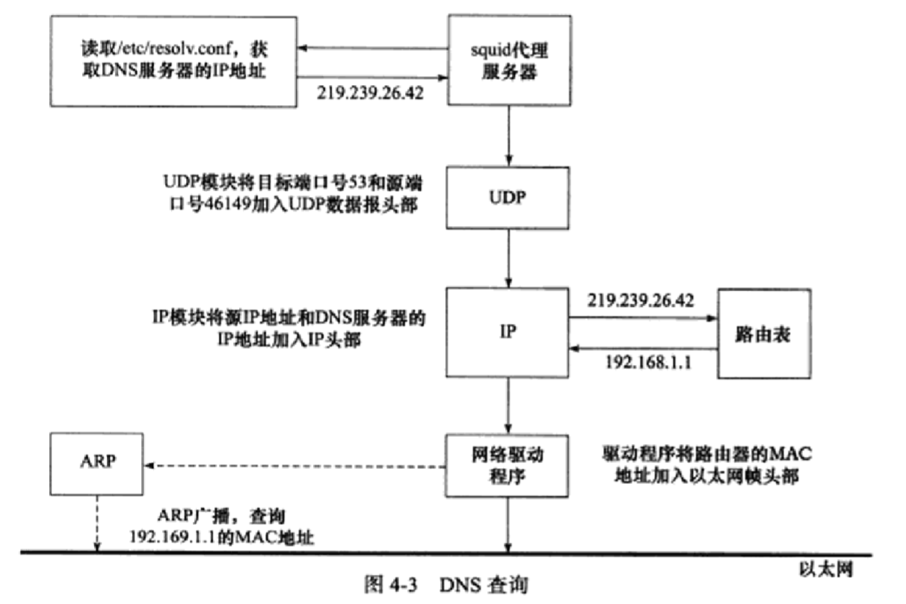

详细说明见书本P63

### 4.5 本地名称查询

如果我们通过主机名来查询本地局域网上网的机器，则可通过本地的静态文件来获得该机器的IP地址。Linux将目标主机名及其对应的IP地址存储在/etc/hosts配置文件中。

Kongming20上/et/hosts文件的内容如下（作者手动修改过）:

```
12.0.0.1		localhost
192.168.1.109 	Kongming20
192.168.1.108	ernest-laptop
```

* 其中第一项指出本地回路地址127.0.0.1的名称是localhost，第二项和第三项则分别描述了Kongming20和ernest-laptop的IP地址及其对应的主机名

如果程序在/etc/hosts文件中未找到目标机器名对应的IP地址，它将求助于DNS服务。

用户可用通过修改/etc/host.conf文件来<font color=red>自定义系统解析主机名的方法和顺序</font>（一般是先访问本地文件/etc/hosts，在访问DNS服务）,Kongming20上的该文件内容如下:

```
order hosts,bind
multi on
```

* 第一行表示有限使用/etc/hosts文件来解析主机名（hosts），失败后再使用DNS服务（bind）
* 第二行表示如果/etc/hosts文件中一个主机名对应多个IP地址，那么解析的结果就包含多个IP地址


## 第5章 Linux网络编程基础API

探讨Linux网络编程基础API和内核中TCP/IP协议族之间的关系，并为后续章节提供编程基础。将从下面个方面讨论Linux网络API：

* socket地址API

  socket最开始的含义是一个IP地址和端口对（ip, port）。它唯一地表示了使用TCP通信的一端。本书称其为socket地址

* socket基础API

  socket的主要API都定义再sys/socket.h头文件中，包括插件socket、命名socket、监听socket、接收连接、发起连接、读写数据、获取地址信息、检测带外标记，以及读取和设置socket选项

* 网络信息API

  Linux提供了一套网络信息API，以实现主机名和IP地址之间的转换，以及服务名称和端口号之间的转换。这些API都定义再netdb.h头文件中。

Linux提供了如下4个函数来完成主机字节序和网络字节序之间的转换：

```C
#include <netinet/in.h>
unsigned long int htonl(unsigned long int hostlong);
unsigned short int htons(unsigned short int hostshort);
unsigned long int ntohl(unsigned long int netlong);
unsigned short int ntohs(unsigned short int netshort);
```


### 5.1 socket地址API

#### 5.1.1 主机字节序和网络字节序

现代CPU的累加器一次都能转载（至少）4字节（这里考虑32位机，下同），即一个整数。那么这4字节在内存中排列的顺序将影响它被累加器装载成的整数的值。

字节序分为：

* 大端字节序（big endian）

  指一个整数的高位字节（23~31bit）存储在内存的低地址处，低位字节（0~7bit）存储在内存的高地址处。现代PC大多采用小端字节序，因此小端字节序又称为主机字节序

* 小端字节序（little endian）

  指整数的高位字节存储在内存的高地址处，而地位字节则存储在内存的低地址处。大端字节序也称为网络字节序

判断大端小端的代码:

```c
#include <stdio.h>

void byteorder()
{
    union{
        short value;
        char union_bytes[sizeof(short)];
    }test;
    test.value = 0x0102;
    if ((test.union_bytes[0] == 1) && (test.union_bytes[1] == 2)){
        printf("big endian\n");
    }
    else if((test.union_bytes[0] == 2) && (test.union_bytes[1] == 1)){
        printf("little endian\n");
    }
    else{
        printf("unknown...");
    }

}


int main(int argc, char argv[])
{
    byteorder();
    return 0;
}

```


#### 5.1.2 通用socket地址

socket网络编程接口中表示socket地址的是结构体sockaddr，定义如下:

```c
#include <bits/socket.h>
struct sockaddr
{
    sa_family_t sa_family;
    char sa_data[14];
}
```

* sa_family成员是地址族类型（sa_family_t）的变量类型

  地址族类型通常于协议族类型对应。常见的协议族（protocol family，也称domain，见后文）和对应的地址族如表5-1所示：

  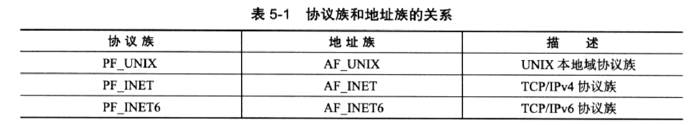

  宏PF\_\*和AF\_\*都定义在bits/socket.h头文件中，且后者与前者有完全相同的值，所以二者通常混用。

* sa_data成员用于存放socket地址值

  不同的协议族的地址值具有不哦那个的含义和长度，如表5-2所示：

  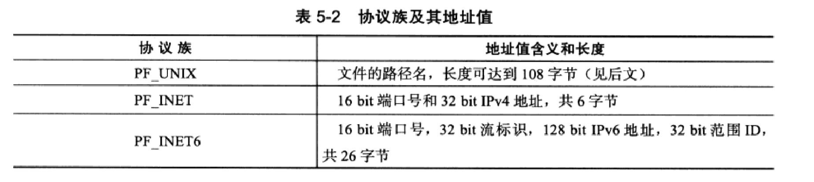

  由表5-2可见，14字节的sa_Data根本无法完全容纳多数协议族的地址值。因此，linux定义了下面这个新的通用socket地址结构体：

  ```c
  # include <bits/socket.h>
  struct sockaddr_storage
  {
      sa_family_t sa_family;
      unsigned long int __ss_align;
      char __ss_padding[128-sizeof(__ss_align)];
  }
  ```


#### 5.1.3 专用socket地址

上面两个通用的socket地址结构体不好用，比如设置与获取IP地址和端口号就需要执行繁琐的位操作。

linux位各个协议族提供了专门的socket地址结构体:

* UNIX本地域协议族使用如下专用socket地址结构体:

  ```c
  #include <sys/un.h>
  struct sockaddr_un {
      __kernel_sa_family_t sun_family; /* 地址族，取AF_UNIX */
      char sun_path[UNIX_PATH_MAX];   /* 文件全路径名*/
  };
  ```

* IPv4

  ```c
  struct sockaddr_in
  {
    	sa_family_t sin_family;   //地址族，取AF_INET
  	in_port_t sin_port;       //端口号，用网络字节序表示
      struct in_addr sin_addr;    //IPv4地址结构，用网络字节序表示
  };
  
  
  struct in_addr
  {
      in_addr_t s_addr;  //存放ipv4地址，用网络字节序表示，in_addr_t就是一个无符号的32位整型
  };
  ```

* IPv6

  ```C
  
  struct sockaddr_in6
  {
      sa_family_t sin6_family;   //地址族，取AF_INET6
      in_port_t sin6_port;        /* 端口号，用网络字节序表示 */
      uint32_t sin6_flowinfo;     /* IPv6 流信息，设置为0n */
      struct in6_addr sin6_addr;  /* IPv6 地址 */
      uint32_t sin6_scope_id;     /* IPv6 id范围 */
  };
  
  struct in6_addr
  {
  	unsigned char sa_addr[16];	/*IPv6地址，要用网络字节序表示*/    
  };
  ```

  <font color=blue>所有专用socket地址（以及sockaddr_storage）类型的变量在实际使用时都需要转化位通用socket地址类型sockaddr（强制转换即可），因为所有socket编程接口使用的地址参数的类型都是sockaddr。</font>


#### 5.1.4 IP地址转换函数

下面3个函数可用于用点分十进制字符表示的IPv4地址和用网络字节序整数表示的IPv4地址之间的转换:

```c
#include <arpa/inet.h>

in_addr_t inet_addr(const char* strptr);
/*用于将用点分十进制字符串表示的IPv4地址转换为用网络字节整数表示的IPv4地址。它失败时返回INADDR_NONE*/

int inet_aton(const char* cp, struct in_addr* ip);
/*完成和inet_addr同样的功能，但是将转换结果存储于参数inp指向的地址结构中。成功时返回1，失败时返回0*/

char * inet_ntoa(struct in_addr in);
/*将用网络字节序整数表示的IPv4地址转化为用点分十进字符串表示的IPv4地址。需要注意的时，该函数内部用一个静态变量存储转换结果，函数的返回值指向该静态内存，一次inet_ntoa是不可重入的*/

```

下面这对更新的函数也能完成和前面3个函数同样的功能，并且它们同时使用于IPv4地址和IPv6地址:

```c
#include <arpa/inet.h>

int inet_pton(int af, const char *src, void *dst); 
 
const char *inet_ntop(int af, const void *src, char *dst, socklen_t size);
```


### 5.2 创建socket

socket系统调用可创建一个socket：

```c
#include <sys/types.h>
#include <sys/socket.h>

int socket(int domain, int type, int protocol);
```

* domain参数高速系统使用哪个底层协议族

  对TCP/IP协议族而言，该参数应该设置为PF_INET(Protocol Family of Internet, 用于IPv4)或PE_INET6(用于IPv6)；对于UNIX本地域协议族而言，该参数应该设置为PE_UNIX。

* type参数指定服务类型

  服务器类型主要由SOCK_STREAM服务（流服务）和SOCK_UGRAM（数据报）服务。对TCP/IP协议族而言，其值取SOCK_STREAM表示传输层使用TCP协议，取SOCK_DGRAM表示传输层使用UDP协议。其他，至内核2.6.17起，type参数可用接收上述类型与下面两个重要的标志相与的值：SOCK_NONBLOCK和SOCK_CLOEXEC。

* protocol参数是在前两个参数构成的协议集合下，再选择一个具体的协议。同参都设置为0，表示使用默认协议。

### 5.3 命令socket

创建socket时，我们给它指定了地址族，但是并未指定使用该地址族中的哪个具体socket地址。<font color=blue>将一个socket与socket地址绑定称为给socket命名</font>。在服务器程序中，我们通常要命名socket，因为只有命名后客户端才能知道如何连接它。客户端则通常不需要命名socket，而是采用匿名方式，即使用操作系统自动分配的socket地址。命名socket的系统调用是bind，其定义如下：

```c
#include <sys/types.h>          /* See NOTES */
#include <sys/socket.h>

int bind(int sockfd, const struct sockaddr *addr, socklen_t addrlen);
```

bind将my_addr所指的socket地址命名分配给未命名的sockfd文件描述符，addrlen参数指出该socket地址的长度。

bind成功时返回0，失败时则返回-1并设置errno

### 5.4 监听socket

socket被命名之后，还不能马上接收客户连接，我们需要使用如下系统调用来创建一个监听队列以存放待处理的客户连接：

```c
#include <sys/types.h>          
#include <sys/socket.h>

int listen(int sockfd, int backlog);
```

* sockefd参数指定被监听的socket

* backlog参数：提示内核监听队列的最大长度

  监听队列长度如果超过backlog，服务器将不受理新的客户连接，客户端也将收到ECONNREFUSED错误信息。

  自内核2.2之后，它只表示处于完全连接状态的socket的上限，处于半连接状态的socket的上限则由/proc/sys/net/ipv4/tcp_max_sys_backlog内核参数定义。backlog参数的典序值时5

* listen成功时返回0，失败则返回-1并设置errno

例子：编写一个服务器程序，如代码清单5-3所示，研究backlog参数对listen系统调用的实际影响。

```c
#include <sys/socket.h>
#include <netinet/in.h>
#include <arpa/inet.h>
#include <signal.h>
#include <unistd.h>
#include <stdlib.h>
#include <assert.h>
#include <stdio.h>
#include <string.h>

static bool stop = false;

/*SIGTERM信号的处理函数，触发时结束主程序中的循环*/
static void handle_term(int sig)
{
    stop = true;
}

int main(int argc, char * argv[])
{
    signal(SIGTERM, handle_term);

    if(argc <= 3)
    {
        printf("usage: %s ip_address port_number backlog\n",
                basename(argv[0]));
        return 1;
    }

    const char* ip = argv[1];
    int port = atoi(argv[2]);
    int backlog = atoi(argv[3]);

    int sock = socket(PF_INET, SOCK_STREAM, 0);
    assert(sock >= 0);

    /*创建一个IPv4 socket地址*/
    struct sockaddr_in address;
    bzero(&address, sizeof(address));
    address.sin_family = AF_INET;
    inet_pton(AF_INET, ip, &address.sin_addr);
    address.sin_port = htons(port);

    int ret = bind(sock, (struct sockaddr*)&address, sizeof(address));
    assert(ret != -1);

    /*循环等待连接， 直到有SIGTERM信号将它中断*/
    while(!stop){
        sleep(1);
    }
    
    /* 关闭socket,见后文*/
    close(sock);
    return 0;
}
```

该服务器程序接收3个参数:ip地址、端口号和backlog值。我们在Kongming20上运行该服务器程序，并在ernest-laptop上多次执行telnet命令来连接该服务器程序。同时，没使用telnet命令建立一个连接，就执行一次netstat命令来查看服务器上连接的状态。具体操作过程如下：

```
$./testlisten 192.16.1.109 12345 5 # 监听123456端口，给backlog传递典型值5
$telnet 192.168.1.109 12345 # 多次执行之
$netstat -nt | grep 12345 #多次执行之
```

代码清单5-4是netstat命令某次输出的内容，它显示了这一时刻listen监听队列的内容：

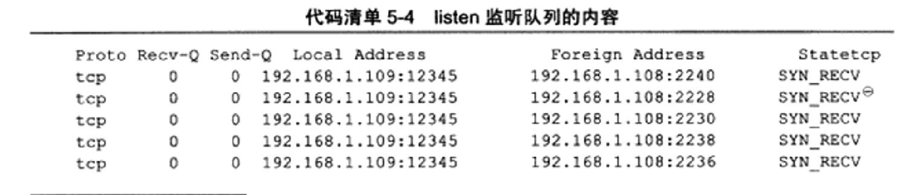

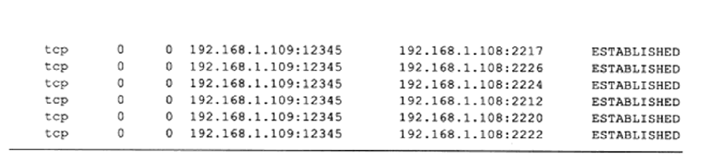

可见，在监听队列中，处于ESTABLISHED状态的连接只有6个（backlog值加1），其他的连接都处于SYN_RCVD状态，完整的连接最多有(backlog+1)个，在不同的系统上，运行结果会有些差别，不过监听队列中完整连接的上限通常比backlog值略大。


## 第13章 多进程编程

### 13.1 fork系统调用

```c
#include <sys/types.h>
#include <unistd.h>
pid_t fork(void);
```

* 每次调用返回两次，在父进程中返回的是子进程的pid，在子进程中则返回0
* 调用失败时返回-1，并设置errno


## 疑问：

1.5 

* 问题1：ARP协议是属于网络层还是链路层

* 问题2：APR协议和IP协议的关系：IP协议每次发送数据都要经过APR协议确认IP对应的MAC地址吗：
  * 答：我们以主机A（192.168.1.5）向主机B（192.168.1.1）发送数据为例。当发送数据时，主机A会在自己的ARP缓存表中寻找是否有目标IP地址。如果找到了，也就知道了目标MAC地址，直接把目标MAC地址写入帧里面发送就可以了；如果在ARP缓存表中没有找到相对应的IP地址，主机A就会在网络上发送一个广播，目标MAC地址是“FF.FF.FF.FF.FF.FF”，这表示向同一网段内的所有主机发出这样的询问：“192.168.1.1的MAC地址是什么？”网络上其他主机并不响应ARP询问，只有主机B接收到这个帧时，才向主机A做出这样的回应：“192.168.1.1的MAC地址是00-aa-00-62-c6-09”。这样，主机A就知道了主机B的MAC地址，它就可以向主机B发送信息了。同时它还更新了自己的ARP缓存表，下次再向主机B发送信息时，直接从ARP缓存表里查找就可以了。ARP缓存表采用了老化机制，在一段时间内如果表中的某一行没有使用，就会被删除，这样可以大大减少ARP缓存表的长度，加快查询速度。


2.1 

* 问题1：IP协议是无状态的，这些数据就可能是乱序和重复的，用抓包工具抓到的数据包是否是也是乱序和重复的？