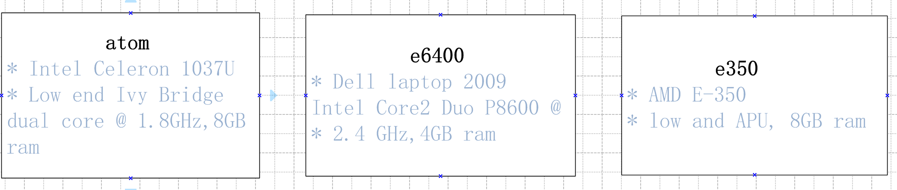
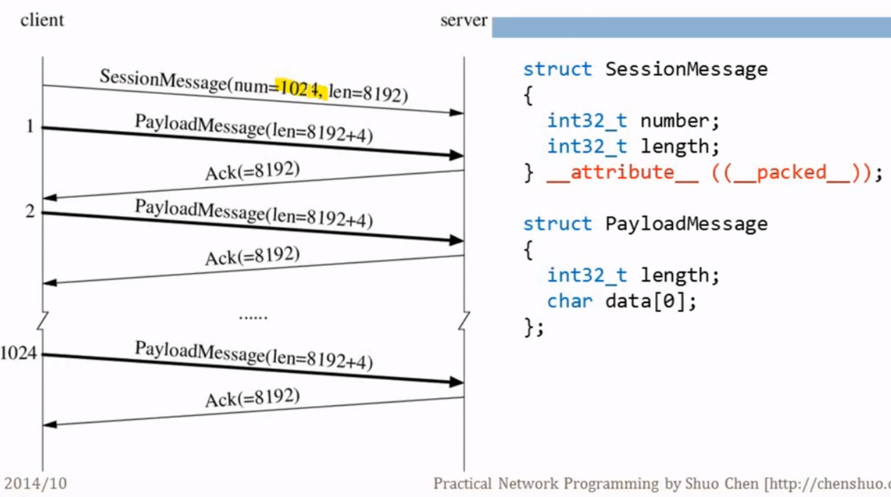

# c++高性能服务器网络编程

## 2. 一个TCP的简单实验

实验用的三台机器：

实验: 在千兆网用nc测试tcp吞吐量

结果:

* 118MB/s  atom和{e6400, e350}之间的传输速度
* 580MB/s 在atom机器上, dd |nc, nc -l > /dev/null
* 1074MB/s 在atom机器上， nc < file，nc -l > /dev/null  (这里面的file已经存在内存中)

## 3. 课程大纲

* 非并发的例子
  * TTCP: 测试TCP性能的机子
  * Round-trip: 测试两台机器的时间差
  * Netcat
  * Slow sink/source：慢速的网络收发工具
* 并发网络编程
  * SOCKS proxy server: 两个tcp连接的中继
  * Sudoku solver:数独的求解  很多服务都适合用这个请求响应模型
  * Simple memcached
  * Broadcasting to multiple TCP peers(应用层tcp的广播): 一个消息发给多个tcp接受端，连接之间有交互；如何处理接受慢的情况
* 多台机器的数据处理
  * Parallel N-queues
  * Median of numbers across machines: 求分布在多台机器上的数的中位数
  * Frequent queries: 找出多台机器中次数最多的查询
  * Distributed sorting: 分布式排序
* 高级主题
  * RPC: 各个服务器的基本构造块
  * Load balancing: 比round-robin好点
  * Capacity of a serving system:  测容量
    * 满足X QPS需要多少台服务器
    * 每个组件的副本数量是多少
  * Fight for (tail) latency：测延迟
    * 平均值和百分比: 95% 99%

## 4. 回顾基础的Sockets API

### 1. Test TCP(ttcp)

ttcp是传统的测试ttcp性能的工具，主要测试两个机器之间tcp的吞吐量

**关心的性能指标：**

* Bandwidth(带宽),MB/s
* Throughput(吞吐量)、messages/s、queries/s(QPS)、transactions/s(TPS)
* Latency(延迟), milliseconds, percentiles(百分位延时)
* Utilization（利用率）, percent, payload vs.carrier, goodpus vs.theory BW
* Overhead（开销）, eg.CPU usage, for compression and/or encryption（压缩和加密用到cpu资源）

**为什么要选用TTCP作为例子：**

* 使用基本的socket APIs: socket, listen, bind, accept, connect, read/recv, write/send, shutdown, colose, etc
* 协议本身是有格式的，比echo的例子更好
* 本身使用tcp实现的程序，有典型的行为
* 该协议可以用多种语言实现，可以根据吞吐量的不同，对比各个语言的开销
* 没有并发连接，比较简单

**The Protocol 协议：**

**代码：**

* Straight Forward with blocking IO(使用阻塞IO)
  * muduo/examples/ace/ttcp/ttcp_blocking.cc(C with sockets API)
  * recipes/tcp/ttcp.cc(c++ with a thin wrapper)
  * muduo-examples-in-go/examples/ace/ttcp/ttcp.go(Go)
* Non-blocking IO with muduo library(非阻塞的IO)
  * muduo/examples/ace/ttcp/ttcp.cc
* None of above support concurrent connections（上面的都不支持并发连接）
  * Pretty easy to enable, thread-per-connection for first three

## 10. 时钟概述

网络编程实战的第二个例子：Roundtrip（基于UDP的例子）

作用：测量两个主机之间的时间差

内容：

* 计时
* 测量时间差
* udp和TCP的对比（从网络编程角度）

### 计时：

时钟 = 振荡器 + 计算器