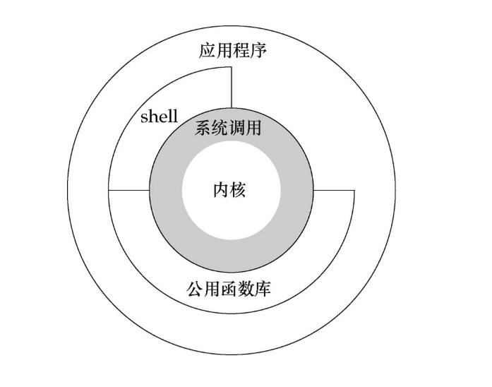

# unid环境高级编程

## 第一章 UNIX基础知识

### 1.2 UNIX体系结构

* 内核：控制计算机硬件资源，提供程序运行环境

* 系统调用：内核的接口
* 公共库：构建在系统调用接口知识
* 应用程序：可使用公共库、系统调用
* shell：特殊的应用程序，为其他应用程序提供了一个接口



### 1.3 登录

#### 1.  登录名

**登录口令文件:**/etc/password

**登录项**:7个字段

* 登录名、加密口令、数据用户ID、数字组ID、注释字段、起始目录、shell程序

  `sar:x:205:105:Stephen Rago:/home/sar:/bin/ksh`

  加密口令已经移到另一个文件中

#### 2. shell

unix有不同的shell，如Boune shell; Bourne-again shell; C shell等

系统根据登录口令文件的最后一个字段判断为登录用户执行哪个shell

#### 1.4 目录

**1. 文件系统**

* 所有东西的起点为**根目录**

* **目录:** 包含目录项的文件
  * 逻辑上，每个目录项都包含一个文件名，还包含说明该文件属性的信息

  * 文件属性

    * 文件类型
    * 文件大小
    * 文件所有者
    * 文件权限
    * 文件的最后修改时间
    * 等
* **stat和fstat函数：** 返回包含所有文件属性的一个信息结构
* 目录项的逻辑视图与实际存**放在磁盘上的方式**是不同的
* 工作目录:
    * 每个进程都有一个工作目录
    * chdir函数:更改工作目录

#### 1.5 输入和输出
**1. 文件描述符**
* 小的非负整数
* 标识一个特定进程正在访问的文件

**2. 标准输入、标准输出和标准错误**
* 运行一个新程序 --> shell为其打开3个文件描述符
* 3个描述符默认链接到终端，可重定向

**3. 不带缓冲的I/O**
* open read write lseek close提供了不带缓冲的I/O, 这些函数都使用文件描述符

* 实例：
将标准输入复制到标准输出
    <details>
      <summary>代码</summary>

    ```c
    #include "apue.h" 

    #define BUFFSIZE 4096 
     
    int main(void) 
    { 
        int n; 
        char buf[BUFFSIZE]; 
     
        while ((n = read(STDIN_FILENO, buf, BUFFSIZE)) > 0) 
            if (write(STDOUT_FILENO, buf, n) != n) 
                err_sys("write error"); 
     
        if (n <0 ) 
            err_sys("read error"); 
     
        exit(0); 
        return 1; 
    } 

    ```

    </details>

* 说明:
    * 标准输入和标准输出通常定义为常量：STDING_FILENO STDOUT_FILENO
    * 文件结束符通常是:Ctrl+D 


**4. 标准I/O**
标准I/O：
* 为不带缓冲的I/O函数提供一个带缓冲的接口
* 无需担心如何选取最佳的缓冲区大小
* 实例：
使用标准I/O接口将标准输入复制到标准输出

    <details>
      <summary>代码</summary>

    ```c
    #include "apue.h"
    
    int main()
    {
        int c;
        while((c = getc(stdin)) != EOF)
            if (putc(c, stdout) == EOF)
                err_sys("out error");
        
        if (ferror(stdin))
            err_sys("input error");
        exit(0);
    }

    ```

    </details>


## 备注
编译
gcc xxx -lapue


